# 微机接口 复习笔记

## 第 2 章 微处理器的结构和工作原理

### 8086 CPU的工作过程

1. 读存储器，从给定地址单元中取出指令，送到指令队列中等待执行。
> 存储器的物理地址 = CS*16+IP，在地址加法器Σ中形成。
2. 执行单元 EU 从指令队列中取走指令并执行。
> 此时 BIU 可将后续指令继续送到指令队列填满。
3. 当指令队列已满，EU 未向 BIU 申请读/写内存或 I/O 操作时，BIU 处于空闲状态。
4. 指令执行过程中，若需对存储器或I/O端口存取数据，EU就要求 BIU 去完成相应的总线周期。
> 例如，EU 执行读内存指令时，先将偏移地址送到 BIU，结合 BIU 中的段地址和地址加法器Σ形成访存的物理地址，再从指定单元取数据送到控制器 EU。
5. 如遇到JMP或CALL指令，则指令队列中的内容作废，按新的转移地址取指令。
6. 算术逻辑部件ALU完成算术运算、逻辑运算或移位等操作。

> 操作数从存储器、I/O端口或EU内部的寄存器获取。
>
> 运算结果送到EU或BIU的寄存器，也可由BIU写入存储器或I/O端口。
>
> 本次操作的状态反映在标志寄存器FLAGS中，如进位和溢出标志。

BIU 和 EU 的分离，使取指令和执行指令可重叠进行，形成简单的流水线。

### 8086 CPU 内部寄存器

8086 有 **14 个 16 位寄存器**，分为四类：

#### 数据寄存器（通用寄存器）

AX、BX、CX、DX 为 16 位通用寄存器，可存放数据或地址。每个可分为两个独立的 8 位寄存器：

| 16位 | 高8位 | 低8位 | 特殊用途 |
|------|-------|-------|----------|
| AX | AH | AL | 累加器，乘除法专用 |
| BX | BH | BL | 基地址指针，可存放偏移地址 |
| CX | CH | CL | 计数寄存器，循环/移位用 |
| DX | DH | DL | 乘除法及 I/O 端口操作 |

#### 地址指针和变址寄存器

存放段内偏移量，与段寄存器配合构成物理地址：

- **SP**（Stack Pointer）：栈顶指针，与 SS 配合使用
- **BP**（Base Pointer）：基址指针，用于访问栈段中的数据
- **SI**（Source Index）：源变址寄存器，串操作中指向源串
- **DI**（Destination Index）：目的变址寄存器，串操作中指向目标串

#### 段寄存器

| 寄存器 | 功能 | 默认配合的偏移寄存器 |
|--------|------|---------------------|
| CS | 代码段 | IP（指令指针） |
| DS | 数据段 | BX、SI、DI、直接地址 |
| SS | 栈段 | SP、BP |
| ES | 附加段 | DI（串操作目标） |

段寄存器存放段起始地址的高 16 位（段基址）。物理地址 = 段基址 × 16 + 偏移量。

#### 指令指针 IP

IP 指向将要执行指令在代码段中的**偏移地址**。CPU 每取出 1 字节指令，IP 自动 +1。CS:IP 共同决定下一条要执行的指令地址。

#### 标志寄存器 FLAGS

FLAGS 有 9 个标志位，分为状态标志和控制标志两类：

**状态标志（反映运算结果）：**

| 标志 | 位 | 名称 | 设置条件 |
|------|----|------|----------|
| CF | D0 | 进位标志 | 无符号运算产生进位/借位 |
| PF | D2 | 奇偶标志 | 结果低 8 位中 1 的个数为偶数 |
| AF | D4 | 辅助进位 | 低 4 位向高 4 位有进位/借位（BCD 运算用） |
| ZF | D6 | 零标志 | 运算结果为 0 |
| SF | D7 | 符号标志 | 结果最高位为 1 |
| OF | D11 | 溢出标志 | 有符号运算结果超出范围 |

**控制标志（由程序设置/清除）：**

| 标志 | 位 | 名称 | 功能 |
|------|----|------|------|
| TF | D8 | 陷阱标志 | =1 时每条指令后产生单步中断 |
| IF | D9 | 中断允许 | =1 时允许可屏蔽中断 |
| DF | D10 | 方向标志 | =0 时串操作地址递增，=1 时递减 |

**标志位判断原则：**
- 无符号数运算后查 **CF**
- 有符号数运算后查 **SF** 和 **OF**
- BCD 数运算后查 **AF**
- 所有运算后都可查 **ZF** 和 **PF**

**标志位计算示例：** +105 + 50 = 155（8位有符号数范围为 -128~+127）

$$105 = 0110\ 1001B, \quad 50 = 0011\ 0010B$$

$$0110\ 1001 + 0011\ 0010 = 1001\ 1011B = 155$$

- CF = 0（无进位）
- PF = 0（10011011 有 5 个 1，奇数个）
- AF = 0（低4位无进位）
- ZF = 0（结果非零）
- SF = 1（最高位为 1，结果为"负"）
- OF = 1（两个正数相加得到负数，溢出）

> 若当作无符号数，结果 155 正确（CF=0）；若当作有符号数，+105+50=155 超出 +127 范围（OF=1）。

### 8086/8088 CPU 的引脚功能

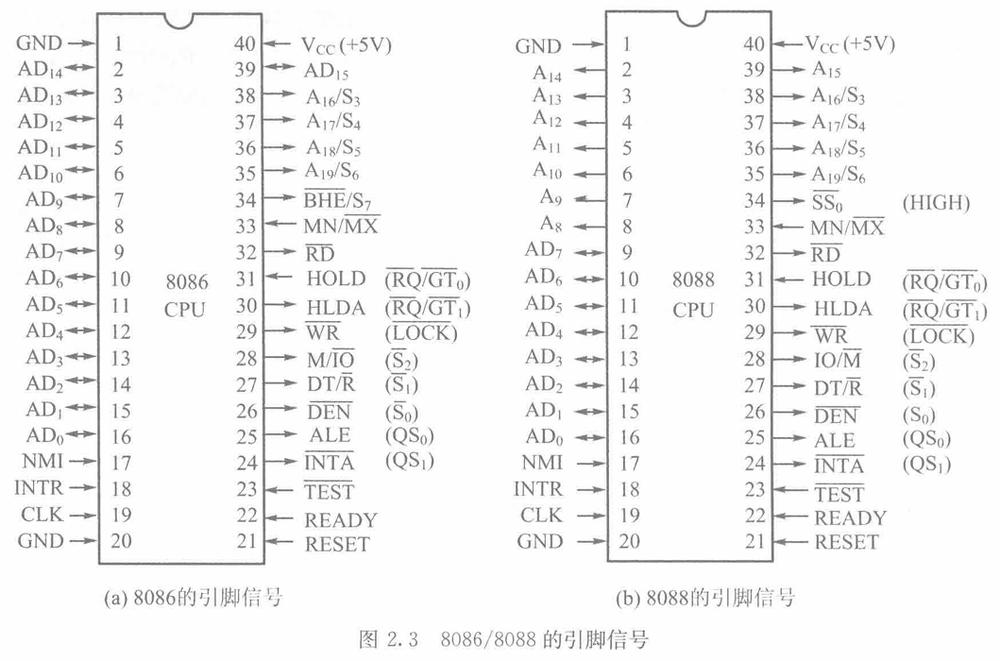

主要引脚信号说明：

- **AD₁₅~AD₀**（地址/数据总线）：双向、三态、分时复用。T1 传送地址并锁存，T2~T4 传送数据
- **A₁₉/S₆~A₁₆/S₃**（地址/状态线）：T1 传送高 4 位地址，T2~T4 传送状态信号
    - S₄S₃ 指示当前使用的段寄存器：00=ES, 01=SS, 10=CS, 11=DS
- **$\overline{RD}$**（读信号）：=0 时允许从存储器或 I/O 端口读数据
- **$\overline{WR}$**（写信号）：=0 时允许向存储器或 I/O 端口写数据
- **$M/\overline{IO}$**：高电平访问内存，低电平访问 I/O 端口
- **ALE**（地址锁存允许）：T1 时输出高电平，锁存地址信号
- **$\overline{DEN}$**（数据允许）：=0 时允许数据总线收发器传送数据
- **$DT/\overline{R}$**（数据发送/接收）：高电平 CPU 发送数据（写），低电平接收数据（读）
- **READY**：=0 时被访设备未准备好，CPU 在 T3 后插入等待周期 Tw
- **$\overline{BHE}$**（高 8 位总线允许）：=0 时 D₁₅~D₈ 有效
- **INTR**（可屏蔽中断请求）：INTR=1 且 IF=1 时 CPU 响应
- **NMI**（不可屏蔽中断）：不受 IF 影响，始终响应
- **$\overline{INTA}$**（中断响应）：CPU 响应中断后向 8259A 发出的回答信号
- **HOLD/HLDA**（总线保持请求/响应）：DMA 操作时使用
- **RESET**：复位信号，复位后 CS=FFFFH, IP=0000H，从 FFFF0H 开始执行
- **CLK**：时钟信号，8086 为 5MHz

### 8086 存储器的分体结构

8086 的 1MB 存储空间被分为两个 512KB 的存储体：
- 偶地址存储体（Even Bank）：连接数据总线低 8 位（D₀~D₇），由 A₀ = 0 选中
- 奇地址存储体（Odd Bank）：连接数据总线高 8 位（D₈~D₁₅），由 BHE（Bus High Enable）= 0 选中

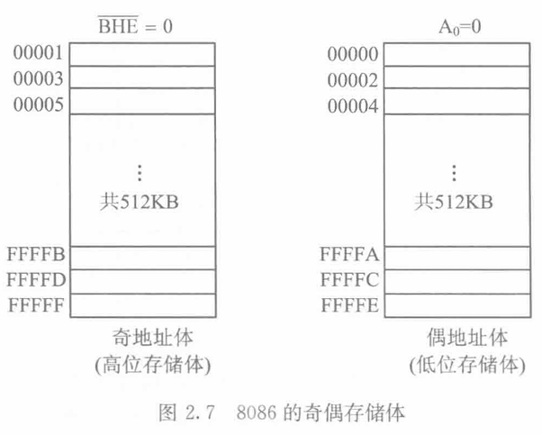

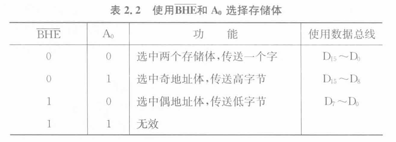

注意 8086 CPU 对存储器进行存取，都是从偶地址体开始：
- 对准字（Aligned Word）：从偶地址开始的 16 位数据，一次总线周期完成（A₀=0, BHE=0）
- 非对准字（Unaligned Word）：从奇地址开始的 16 位数据，需要两个总线周期（先读奇地址字节，再读偶地址字节，CPU 内部拼接）

### 8086 的两种工作模式

8086 有两种工作模式：最小模式（Minimum Mode）和最大模式（Maximum Mode）。选择工作模式由 $MN/\overline{MX}$ 引脚决定

#### 最小模式系统

$MN/\overline{MX}$ 引脚接 +5V 工作于最小模式，此时送到存储器和 I/O 接口的所有信号都由 CPU 产生。

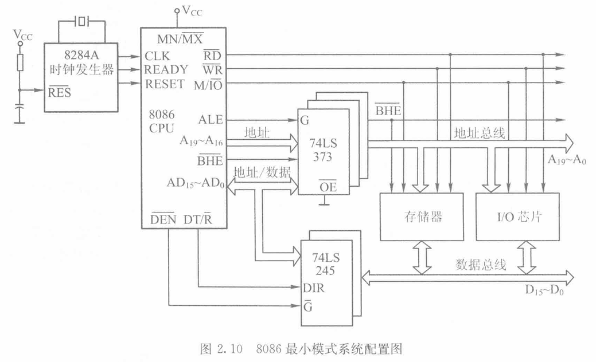

8086/8088 与存储器、I/O 接口芯片一起使用，必须分离多路复用总线信号（8086 中使用 3 片 74LS373 锁存器），总线上先传送地址信号，锁存器锁存地址信号后，再传送数据或状态信号。

- 数据总线缓冲器
    - 74LS244：8 位单向缓冲器/驱动器（两组 4 位，各带独立使能端）
    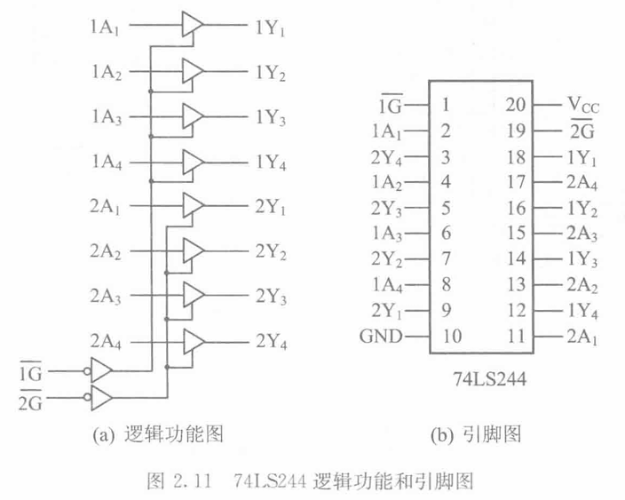

    - 74LS245：8 位双向总线收发器，有两片（因为 8086 数据总线是 16 位）并联在数据总线上
        - 方向控制（DIR 引脚）：由 8086 的 RD 信号控制，决定数据流向（CPU→外设 或 外设→CPU）。
        - 使能控制（$\overline{G}$ 引脚）：通常由 8086 的 DEN（Data Enable）信号控制，仅在数据传输期间打开缓冲器，平时处于高阻态，隔离总线。
    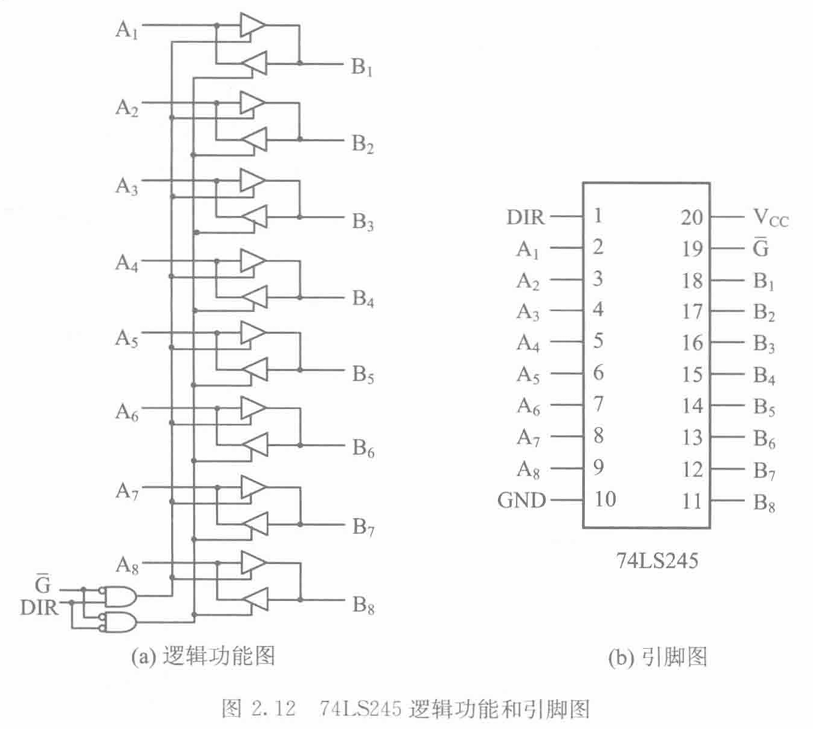
- 锁存器 74LS373
    - 8086 的地址总线 A₀~A₁₅ 和 A₁₆~A₁₉ 是分时复用的，必须使用锁存器将地址信号锁存下来，提供稳定的地址输出。
    - 74LS373 是 8 位透明锁存器，通常使用三片分别锁存 A₀~A₇、A₈~A₁₅ 和 A₁₆~A₁₉。
    - 锁存器的 LE（Latch Enable）引脚由 8086 的 ALE（Address Latch Enable）信号控制，在 T1 状态时为高电平，允许地址信号通过；在 T2 状态时为低电平，锁存地址信号，保持稳定输出。
    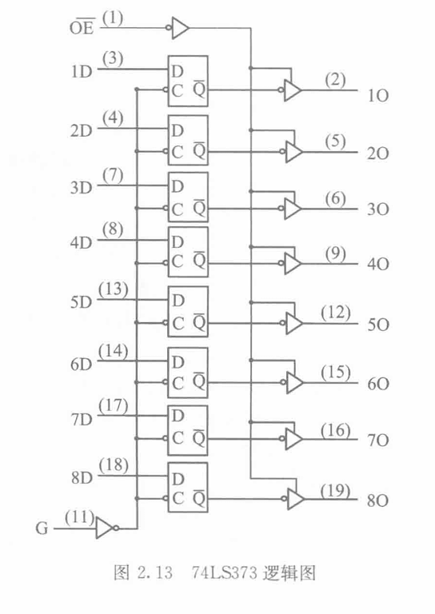
    参考：[74LS245 vs 74LS373 作用详解](io-74LS245-vs-74LS373.md)
- 时钟发生器 824A

工作过程：
1. CPU 送出 $M/\overline{IO}$ 和 $DT/\overline{R}$ 信号（准备从存储器中读数据）
2. CPU 先送出地址信号和 $\overline{BHE}$ 信号，再送出地址锁存信号 ALE
3. 锁存的地址信号和 $\overline{BHE}$ 信号一起向外送到 PC 总线上
4. CPU 使 $\overline{RD}$ = 0，$\overline{DEN}$ = 0（从存储单元读出数据）

#### 最大模式系统

和最小模式相比，最大模式系统增加了一个总线控制器 8288，用于产生被占用的最小模式信号和一些新的控制信号。

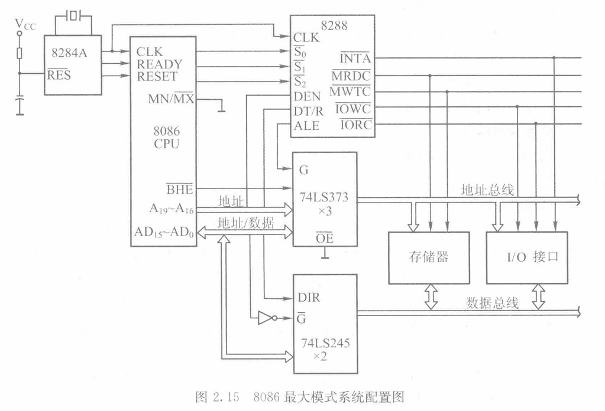


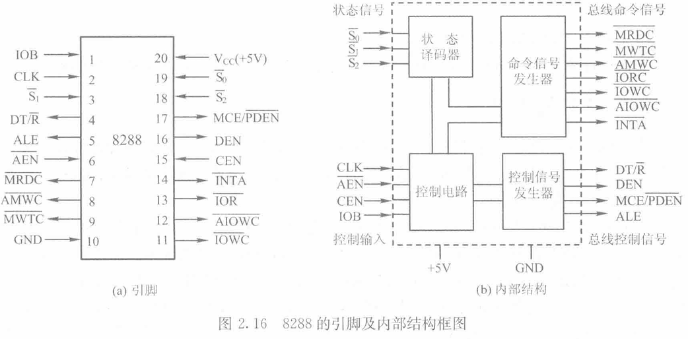

8288 的输入输出信号分成 4 组：
- 状态输入信号 $\overline{S₂}$~$\overline{S₀}$（总线周期类型信号）
- 由外部输入的控制信号
- 总线控制信号
- 总线命令信号（控制存储器和 I/O 读写）

### 总线操作时序

#### 最小模式 读总线周期

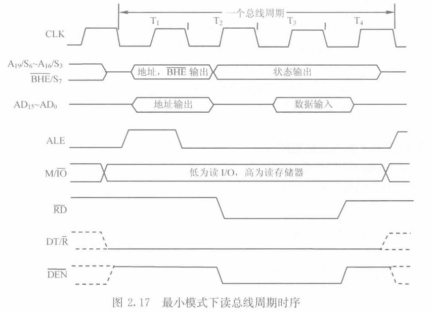

- T1 状态：CPU 确定数据源，送出地址信号和控制信号，锁存器锁存地址信号
- T2 状态：缓冲，读信号有效，数据总线准备传输
- T3 状态：数据传输，CPU 从数据总线上读取数据
- T4 状态：结束，CPU 释放总线，准备下一个总线周期

#### 最小模式 写总线周期

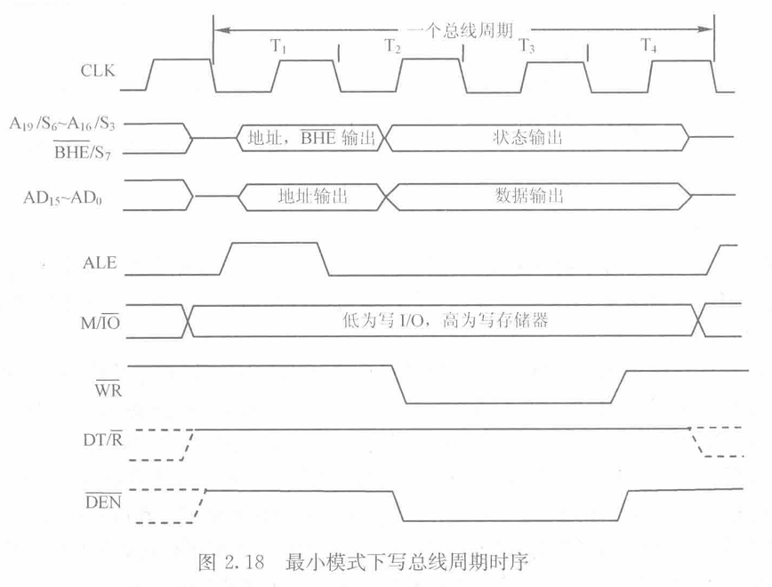

tips：[8086读写总线周期对比](io-8086-rw-cycle.md)

## 第 5 章 存储器

### SRAM 芯片 6116 设置行列译码的原理

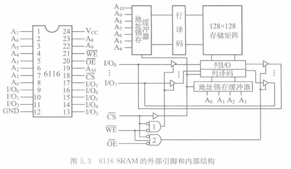

| 方案 | 译码线数量 | 复杂度 |
| - | - | - |
| 一维译码 | 16384 根 | 极高，不可行 |
| 二维译码（128×128） | 128 + 16 = **144 根** | 大幅降低，实用 |

### 位结构形式

> 位结构形式 = 一个芯片只存"所有字节的同一位"，用多片并联拼出完整的数据宽度。

| 对比项 | 位结构形式（DRAM） | 字结构形式（SRAM） |
| - | - | - |
| **组织方式** | 所有存储单元排成 **一列** | 存储单元按 **字节/字** 组织 |
| **数据宽度** | **1 位**（×1） | 多位（×4、×8、×16 等） |
| **一次访问** | 只能读写 **1 个二进制位** | 可以读写 **1 个字节/字** |
| **芯片内数据** | 同一芯片只存储各字节的 **同一位** | 同一芯片存储完整的字节/字 |

### DRAM 的刷新

| 对比项 | 集中刷新 | 分散刷新 | 异步刷新 |
| - | - | - | - |
| **刷新时机** | 集中一段时间 | 每个周期后 | 均匀分散 |
| **存取周期** | 0.5μs（不变） | **1μs**（延长） | 0.5μs（不变） |
| **死时间** | **64μs**  | **无** | **0.5μs** |
| **系统速度** | 快（除死时间外） | **慢**（周期拉长） | **最快** |
| **控制复杂度** | 简单 | 简单 | 较复杂 |
| **实用性** | 较低 | 较低 | **最高** |

### 存储空间的扩展（位扩展、字扩展）

个人理解：位扩展→宽度，相当于并联；字扩展→容量，相当于串联；

- “字”的含义：内存中的一个数据
- “位”的含义：一个数据的位数即宽度

### 74LS138 译码器

74LS138 是常用的 **3-8 译码器**（8 中取 1），用于生成存储器和 I/O 芯片的片选信号。

- **输入**：3 位选择输入 C、B、A（对应地址线）
- **输出**：8 个低电平有效输出 $\overline{Y_0}$~$\overline{Y_7}$
- **使能端**：G1（高电平有效）、$\overline{G_{2A}}$ 和 $\overline{G_{2B}}$（低电平有效）
    - 三个使能端条件**同时满足**时译码器才工作：G1=1, $\overline{G_{2A}}$=0, $\overline{G_{2B}}$=0

> 通常将高位地址线接到 C、B、A，将更高位地址和控制信号接到使能端，实现多级地址译码。

### 形成片选信号的三种方法

#### 线选法

用**某 1 位**高位地址直接做片选信号，低位地址接芯片地址线。

- 优点：电路简单，无需译码器
- 缺点：地址空间浪费大，存在大量**地址重叠**

> 例：2 片 2764（8KB，13 根地址线 A₁₂~A₀），用 A₁₃ 和 A₁₄ 分别做片选。A₁₃=0 选中芯片 1，A₁₄=0 选中芯片 2。A₁₉~A₁₅ 不参与译码，有 $2^5=32$ 个地址重叠区。

#### 全译码法

**全部**高位地址都参与译码，每个存储单元的地址**唯一**，不存在地址重叠。

- 优点：地址唯一，无重叠
- 缺点：译码电路复杂

> 例：1 片 27128（16KB，14 根地址线 A₁₃~A₀），要求地址 1C000H~1FFFFH。A₁₉~A₁₄ 全部参与译码，用 74LS138 对 A₁₇A₁₆A₁₅=011 输出低电平选中该芯片。

#### 部分译码法

只对高位地址中的**部分位**译码，简化电路但存在地址重叠。

- 优点：电路较简单
- 缺点：存在地址重叠（编程时一般将未用地址位设为 0）

> 例：4 片 2732（4KB）构成 16KB 存储器。用 A₁₆~A₁₂ 参与译码，A₁₉~A₁₇ 不参与。

### 存储扩展的具体电路

#### 位扩展（增加数据宽度）

多片同类芯片**并联**：地址线共用，各片提供不同数据位。

> 例：用 8 片 64K×1 芯片扩展成 64K×8（64KB）。各片的 A₇~A₀ 并接，$\overline{WE}$/$\overline{OE}$/$\overline{CE}$ 并联，各 I/O 脚分别连 D₇~D₀。

#### 字扩展（增加容量）

芯片数据宽度已符合，用译码器产生片选信号来增加芯片数量。

> 例：用 4 片 16K×8 芯片字扩展为 64K×8。A₁₃~A₀、D₇~D₀、$\overline{WE}$ 并联，用 2-4 译码器的输出分别接各片的 $\overline{CE}$。

#### 字位同时扩展

先做位扩展（并联成一组），再做字扩展（多组串联）。

> 例：用 1K×4 的 2114 芯片构成 4K×8 存储器。先 2 片并联成 1K×8（一组），再用 2-4 译码器对 4 组做字扩展。

## 第 6 章 I/O 接口和并行接口芯片 8255A

### I/O 接口 的功能

I/O 接口的出现，解决了外设与 CPU 进行信息交换时的各方面不匹配问题。

1. 设置数据缓冲（锁存器和缓冲器）
2. 设置信号电平转换电路（串行通信）
3. 设置信息转换逻辑（模拟/数字）
4. 设置时序控制电路（同步）
5. 提供地址译码电路（选中某一 I/O 端口）

### I/O 端口

- 数据端口（数据缓冲）
- 状态端口
    - 准备就绪位（Ready）
    - 忙碌位（Busy）
    - 错误位（Error）
- 命令端口/控制端口（控制接口或设备的动作）
    - 启动位
    - 停止位
    - 允许中断位

外设的数据端口含有 8 位（以字节为单位），而不同外设的状态口和命令口允许共用一个端口。

数据信息、状态信息和命令信息的含义各不相同，但在微型计算机系统中，只有输入（IN）和输出（OUT）两种指令，所以都当作数据信息通过数据总线来传送。

### I/O 端口的寻址方法

- 存储器映像寻址
    - 把每一个 I/O 端口看作一个存储单元，并与存储单元统一编址
    - 占用了存储单元的地址空间
- I/O 单独编址
    - 单独编址构成一个 I/O 空间，不占用存储空间
    - 需要设有专门的 IN/OUT 指令

### CPU 与外设间的数据传送方式

1. 程序控制方式
    - 无条件传送/同步传送
        - 简单外设操作
        - 外设的定时固定或已知
    - 条件传送/查询式传送
        - 确认外设已处于准备传送数据的状态
2. 中断方式
    - 提高 CPU 利用率和进行实时数据处理
3. DMA 方式（硬件实现）
    - 外设和存储器之间直接传送数据
    - 发送请求，让 DMA 控制器临时接管总线
    - DMA 传送结束后释放总线

### PC 机的 I/O 地址分配

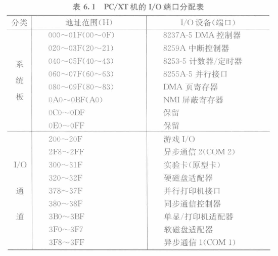

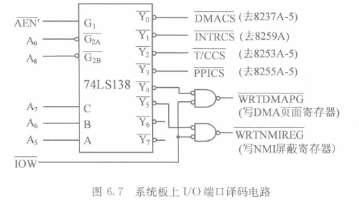

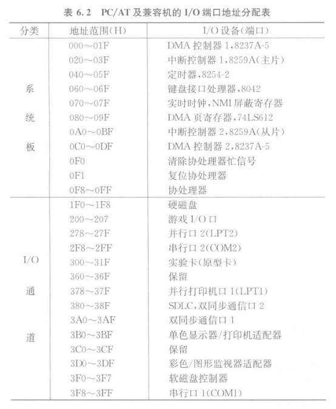

### 8255A 的结构和功能

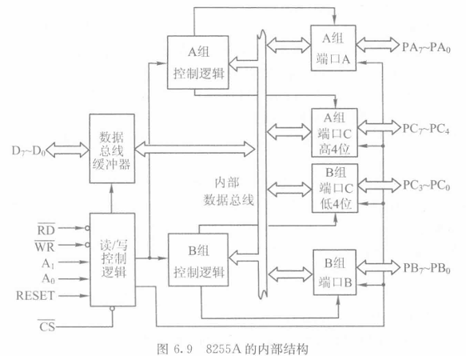

1. 数据端口
    - 3 个 8 位的输入输出端口 A、B、C
    - 端口 A、B、C 都可以用作一个 8 位的输入输出端口
    - 端口 C 还能用作两个 4 位的输入输出端口

### 8255A 的控制字

8255A 有两种控制字：**方式控制字**和**C口置位/复位控制字**，都写入控制口（最高地址端口）。

#### 方式控制字（D7=1）

| D7 | D6 D5 | D4 | D3 | D2 | D1 | D0 |
|----|--------|----|----|----|----|-----|
| 1 | A组方式 | PA方向 | PC高方向 | B组方式 | PB方向 | PC低方向 |

- **D7 = 1**：标识为方式控制字
- **D6 D5**：A 组工作方式（00=方式0, 01=方式1, 1X=方式2）
- **D4**：PA 口方向（0=输出, 1=输入）
- **D3**：PC 高 4 位方向（0=输出, 1=输入）
- **D2**：B 组工作方式（0=方式0, 1=方式1）
- **D1**：PB 口方向（0=输出, 1=输入）
- **D0**：PC 低 4 位方向（0=输出, 1=输入）

**例：** A口方式0输入，B口方式0输出，C口高4位输入，C口低4位输出：

控制字 = 10011010B = **9AH**

```asm
MOV AL, 10011010B     ; 方式控制字
OUT 控制口, AL        ; 写入控制口
```

#### C口置位/复位控制字（D7=0）

| D7 | D6 D5 D4 | D3 D2 D1 | D0 |
|----|-----------|-----------|----|
| 0 | 不用 | 位选择（000~111） | 置位/复位 |

- **D7 = 0**：标识为 C 口置位/复位控制字
- **D3 D2 D1**：选择 PC 口的哪一位（000=PC₀, 111=PC₇）
- **D0**：0=复位（清0），1=置位（置1）

> C 口置位/复位功能在方式 1 和方式 2 中用于控制中断允许触发器（INTE）。例如，使 PC₄ 置 1 可允许 A 口中断。

### 8255A 的三种工作方式

#### 方式 0 — 基本输入输出

- 适用于**不需要应答信号**的简单 I/O 场合
- A口、B口各作 8 位端口，C口可作两个 4 位或一个 8 位端口
- **输出可锁存，输入不锁存**
- A口、B口、C高、C低可构成 16 种不同输入/输出组态

#### 方式 1 — 选通输入输出

- 需要**联络（握手）信号**配合才能工作
- A口、B口作数据口（均可输入或输出），数据可锁存
- C口的 PC₀~PC₅ 用作联络信号

**选通输入联络信号：**

| 信号 | 含义 | A口引脚 | B口引脚 |
|------|------|---------|---------|
| $\overline{STB}$ | 选通信号（外设→8255A） | PC4 | PC2 |
| IBF | 输入缓冲器满（8255A→外设） | PC5 | PC1 |
| INTE | 中断允许（内部触发器） | PC4置位 | PC2置位 |
| INTR | 中断请求（8255A→CPU） | PC3 | PC0 |

**选通输出联络信号：**

| 信号 | 含义 | A口引脚 | B口引脚 |
|------|------|---------|---------|
| $\overline{OBF}$ | 输出缓冲器满（8255A→外设） | PC7 | PC1 |
| $\overline{ACK}$ | 外设应答信号（外设→8255A） | PC6 | PC2 |
| INTE | 中断允许 | PC6置位 | PC2置位 |
| INTR | 中断请求 | PC3 | PC0 |

> 方式 1 中，读 C 口可获得状态字，可用于查询方式代替中断方式。

#### 方式 2 — 双向总线方式

- 仅 **A 口**支持方式 2
- A 口既能输入也能输出，与外设双向交换数据
- 输入和输出都能锁存
- C 口 PC₃~PC₇ 用作联络信号

### 8255A 应用编程示例

#### 示例 1：开关输入 + LED 输出（方式 0）

```
硬件：PA 口接 8 个开关 K₇~K₀（输入），PB 口接 8 个 LED₇~LED₀（输出）
8255A 端口地址：F0H（PA）、F2H（PB）、F4H（PC）、F6H（控制口）
```

```asm
; 初始化：A口方式0输入，B口方式0输出
MOV DX, 0F6H          ; 控制口地址
MOV AL, 10010000B     ; 控制字 = 90H
OUT DX, AL

; 循环检测
TEST_IT:
    MOV DX, 0F0H      ; PA 口
    IN AL, DX         ; 读开关状态
    MOV DX, 0F2H      ; PB 口
    OUT DX, AL        ; 输出到 LED
    CALL DELAY        ; 延时
    JMP TEST_IT
```

#### 示例 2：开关 + 七段 LED 显示（方式 0）

```
硬件：PA 口低 4 位接 4 个开关 K₃~K₀（输入），PB 口低 7 位经反相驱动接七段 LED
4 个开关 → 16 种状态（0000~1111）→ 对应显示 0~F
七段 LED 共阴极，PBi=0 时经反相后对应段亮
```

**七段 LED 编码表（共阴极，经 74LS04 反相驱动）：**

| 显示 | 七段码（PB₆~PB₀） | 十六进制 |
|------|-------------------|----------|
| 0 | 100 0000 | 40H |
| 1 | 111 1001 | 79H |
| 2 | 010 0100 | 24H |
| 3 | 011 0000 | 30H |
| 4 | 001 1001 | 19H |
| 5 | 001 0010 | 12H |
| 6 | 000 0010 | 02H |
| 7 | 111 1000 | 78H |
| 8 | 000 0000 | 00H |
| 9 | 001 1000 | 18H |
| A | 100 0000 | 80H |
| b | 000 0011 | 03H |
| C | 100 0011 | 43H |
| d | 010 0001 | 21H |
| E | 000 0110 | 06H |
| F | 000 1110 | 0EH |

```asm
; 七段码表
TABLE DB 40H,79H,24H,30H,19H,12H,02H,78H
      DB 00H,18H,80H,03H,43H,21H,06H,0EH

; 初始化
MOV AL, 90H           ; A口方式0输入，B口方式0输出
OUT 63H, AL           ; 写控制字

; 循环
IN_PA:
    IN AL, 60H        ; 读 PA 口（开关状态）
    AND AL, 0FH       ; 取低 4 位
    MOV BX, OFFSET TABLE
    XLAT              ; 查表：AL ← (BX+AL)
    OUT 61H, AL       ; 输出到 PB 口
    CALL DELAY
    JMP IN_PA
```

> **XLAT 指令**：查表转换指令，AL ← (BX + AL)，BX 指向表首地址，AL 中为索引值。

## 第 7 章 可编程计数器/定时器 8253

### 8253 的内部结构

8253 内部有 **3 个独立的 16 位减法计数器**（通道 0、1、2），以及一个**控制寄存器**。三个计数器共用一个控制口，各自有独立的 CLK（时钟输入）、GATE（门控输入）和 OUT（输出）引脚。

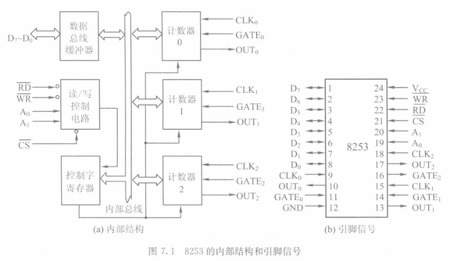

### 8253 的端口地址

8253 占用 **4 个 I/O 端口**：

| 端口 | 功能 |
|------|------|
| 偶地址 + 0 | 通道 0 数据口 |
| 偶地址 + 2 | 通道 1 数据口 |
| 偶地址 + 4 | 通道 2 数据口 |
| 偶地址 + 6 | 控制口（只写） |

> 注意：8086 系统中 8253 通常接在偶地址端口（A1 接 A0），所以端口间隔为 2（如 200H, 202H, 204H, 206H）。

### 8253 的控制字格式

| D7 D6 | D5 D4 | D3 D2 D1 | D0 |
|--------|--------|-----------|-----|
| SC1 SC0 | RL1 RL0 | M2 M1 M0 | BCD |

- **SC1 SC0** — 通道选择
    - 00 = 通道 0，01 = 通道 1，10 = 通道 2，11 = 读回命令
- **RL1 RL0** — 读写方式
    - 00 = 锁存当前计数值
    - 01 = 只读/写低字节
    - 10 = 只读/写高字节
    - 11 = 先写低字节，后写高字节
- **M2 M1 M0** — 工作方式
    - 000 = 方式 0，001 = 方式 1，X10 = 方式 2，X11 = 方式 3，100 = 方式 4，101 = 方式 5
- **BCD** — 计数制
    - 0 = 二进制计数（最大 65536），1 = BCD 计数（最大 10000）

### 8253 的 6 种工作方式

| 方式 | 名称 | 特点 | 典型应用 |
|------|------|------|----------|
| **方式 0** | 计数结束中断 | 写入初值后开始减计数，到 0 时 OUT 变高 | 事件计数、中断请求 |
| **方式 1** | 可编程单稳态 | GATE 上升沿触发，OUT 变低，计数到 0 时 OUT 变高 | **产生单脉冲** |
| **方式 2** | 分频器 | 周期性输出窄脉冲（OUT 低电平持续 1 个 CLK） | 频率分频 |
| **方式 3** | 方波发生器 | 输出**方波**（高电平 ≈ 低电平 ≈ 初值/2 个 CLK） | **产生方波** |
| 方式 4 | 软件触发选通 | 计数到 0 时 OUT 产生一个 CLK 宽的负脉冲 | 软件触发 |
| 方式 5 | 硬件触发选通 | GATE 触发后计数到 0 产生负脉冲 | 硬件触发 |

**方式 0 特点：**
- 写入控制字后 OUT 为低电平
- 写入计数初值后开始计数（GATE=1 时）
- 计数到 0 时 OUT 变高并保持

**方式 3（方波）的计数规则：**
- 初值为偶数：高电平 = 低电平 = 初值 / 2
- 初值为奇数：高电平 = (初值+1)/2，低电平 = (初值-1)/2

> **频率计算：** 输出频率 = 输入时钟频率 / 计数初值

### 8253 的初始化编程

编程步骤：先写控制字到控制口，再写计数初值到对应通道口。

```asm
; 例：通道 0 工作于方式 3，产生 1kHz 方波
; 时钟频率 = 1MHz，计数初值 = 1MHz / 1kHz = 1000

mov al, 00110110B    ; SC=00(通道0), RL=11(先低后高), M=011(方式3), BCD=0
out 控制口, al       ; 写控制字

mov ax, 1000         ; 计数初值
out 通道0口, al      ; 写低字节
mov al, ah
out 通道0口, al      ; 写高字节
```

### 8253 的级联使用

当需要大计数值时（超过 65536），可以将两个通道级联：通道 0 的 OUT 接通道 1 的 CLK。

```
总分频比 = 通道 0 初值 × 通道 1 初值
```

**例：** 时钟 2MHz，要求通道 0 输出 2kHz 方波，通道 1 输出 100ms 单脉冲。

- 通道 0（方式 3）：初值 = 2MHz / 2kHz = **1000**，输出 2kHz 方波
- 通道 1（方式 1）：CLK 接通道 0 的 OUT（2kHz），初值 = 2kHz × 0.1s = **200**
- GATE 由外部触发，触发后 OUT 保持低电平 200 个时钟周期 = **100ms**

---

## 第 8 章 中断系统与可编程中断控制器 8259A

### 中断的基本概念

- **中断源**：产生中断请求的设备或事件
- **中断类型码**：8 位编号（0~255），用于定位中断处理程序
- **中断向量**：中断处理程序的入口地址（CS:IP）
- **中断响应**：CPU 收到中断后转入中断处理程序的过程

### 8086 的中断分类

| 分类 | 来源 | 类型码 | 说明 |
|------|------|--------|------|
| **内部中断** | 除法错 | 0 | 除 0 或商溢出 |
| | 单步中断 | 1 | TF=1 时每条指令后触发 |
| | NMI | 2 | 不可屏蔽中断引脚 |
| | 断点 | 3 | INT 3 指令 |
| | 溢出 | 4 | INTO 指令（OF=1 时） |
| | 软件中断 | n | INT n 指令 |
| **外部中断** | INTR | 由 8259A 提供 | 可屏蔽中断，受 IF 控制 |

### 中断响应过程

CPU 响应中断后，硬件自动完成以下步骤：

1. **取中断类型码** N
2. **FLAGS 入栈**（PUSHF）
3. **TF = 0, IF = 0**（禁止单步中断和可屏蔽中断）
4. **CS 入栈**（保护断点）
5. **IP 入栈**（保护断点）
6. 从**中断向量表**取入口地址：(IP) = [N×4], (CS) = [N×4+2]
7. 转入中断处理程序执行

中断处理完成后，**IRET** 指令恢复 CS、IP、FLAGS，返回主程序。

### 中断向量表

- 位于内存 **00000H ~ 003FFH**（共 1024 字节）
- 存放 256 个中断向量，每个占 **4 字节**（低 2 字节 = IP，高 2 字节 = CS）
- N 号中断向量的地址 = **N × 4**

**设置中断向量表示例：**
```asm
; 将 N 号中断的入口设为 0000:0200H
mov ax, 0
mov es, ax
mov word ptr es:[N*4], 200H      ; IP
mov word ptr es:[N*4+2], 0       ; CS
```

### 中断优先级

8086 的中断优先级从高到低：

1. 除法错、INT n、INTO（最高，同等级）
2. NMI（不可屏蔽中断）
3. INTR（可屏蔽中断，由 8259A 引入）
4. 单步中断（最低）

### 中断嵌套

- 进入中断后硬件自动关中断（IF=0）
- 若需允许高优先级中断打断当前中断处理，必须在中断服务程序中用 **STI** 指令重新开中断
- 中断结束前，用 **EOI** 命令通知 8259A 结束该级中断
- 用 **IRET** 返回断点

### 8259A 的内部结构

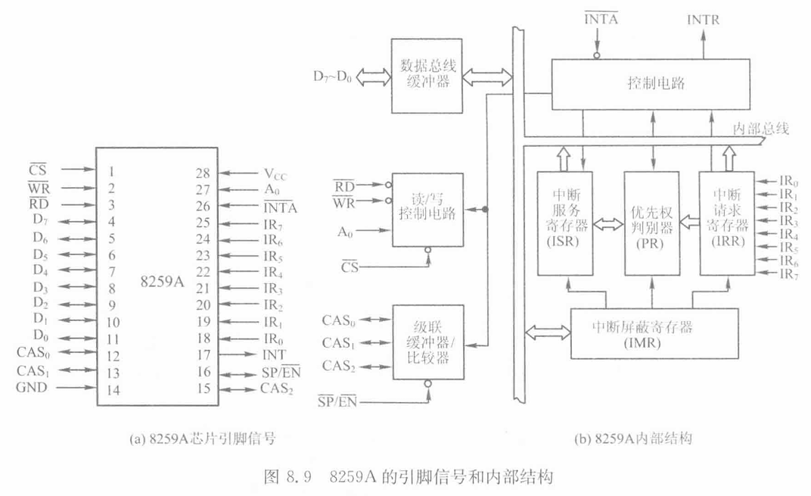

8259A 内部包含 8 个主要部件：

1. **IRR（中断请求寄存器）**：8 位，记录哪些 IR 引脚有中断请求（置 1）
2. **IMR（中断屏蔽寄存器）**：8 位，对应位为 1 则屏蔽该级中断
3. **ISR（中断服务寄存器）**：8 位，记录正在处理的中断（置 1）
4. **PR（优先级判决器）**：比较 IRR 和 ISR，选出最高优先级的有效请求
5. **控制电路**：管理 ICW1~ICW4 和 OCW1~OCW3
6. **数据总线缓冲器**：与 CPU 的数据接口
7. **读/写控制电路**：接收 CS、RD、WR、A0 信号
8. **级联缓冲器/比较器**：多片 8259A 级联时使用

### 8259A 的引脚

- **IR0~IR7**：8 个中断请求输入（可高电平或上升沿触发）
- **INT**：中断请求输出，接 CPU 的 INTR
- **$\overline{INTA}$**：中断响应输入，接 CPU 的 INTA 信号
- **D0~D7**：数据总线
- **$\overline{RD}$、$\overline{WR}$、$\overline{CS}$**：读写和片选
- **A0**：地址线，选择偶/奇端口
- **CAS0~CAS2**：级联信号线
- **$\overline{SP}/\overline{EN}$**：单片/从片编程 或 缓冲使能

### 8259A 的命令字

8259A 通过 **初始化命令字（ICW1~ICW4）** 和 **操作命令字（OCW1~OCW3）** 进行编程。

#### ICW1（初始化命令字 1，写偶地址口）

| D7 D6 D5 | D4 | D3 | D2 | D1 | D0 |
|-----------|----|----|----|----|----|
| 0 0 0 | 1 | LTIM | 0 | SNGL | IC4 |

- D4 = 1 标识 ICW1
- LTIM：0 = 边沿触发，1 = 电平触发
- SNGL：1 = 单片，0 = 级联
- IC4：1 = 需要 ICW4，0 = 不需要

#### ICW2（中断类型码，写奇地址口）

| D7 D6 D5 D4 D3 | D2 D1 D0 |
|-----------------|-----------|
| T7 T6 T5 T4 T3 | 自动填入（对应 IR0~IR7 的 000~111） |

- **高 5 位**由用户设置，定义中断类型码的基址
- 低 3 位由 8259A 自动填入（IR0=000, IR1=001, ..., IR7=111）

**例：** 中断类型号 38H~3FH → ICW2 = **38H**

```asm
mov al, 38H
out 奇地址口, al     ; 写 ICW2
```

#### ICW3（级联配置，写奇地址口）

- 主片 ICW3：每位对应一个 IR 引脚，位=1 表示该引脚接从片
- 从片 ICW3：低 3 位 = 接到主片的哪个 IR 引脚编号

#### ICW4（写奇地址口）

| D7~D5 | D4 | D3 | D2 | D1 | D0 |
|--------|----|----|----|----|----|
| 0 0 0 | SFNM | BUF | M/S | AEOI | μPM |

- μPM = 1：8086/8088 模式
- AEOI = 1：自动 EOI
- BUF/M/S：缓冲方式和主从设置

#### OCW1（中断屏蔽字，写奇地址口）

直接对应 IMR 寄存器：

- 位 = 1 → **屏蔽**对应 IR 的中断
- 位 = 0 → **允许**对应 IR 的中断

**例：** 只允许 IR1、IR3、IR4 中断：

```
IR7 IR6 IR5 IR4 IR3 IR2 IR1 IR0
 1   1   1   0   0   1   0   1   = EDH
```

```asm
mov al, 0EDH
out 奇地址口, al
```

#### OCW2（中断结束命令，写偶地址口）

| D7 D6 D5 | D4 D3 | D2 D1 D0 |
|-----------|--------|-----------|
| R SL EOI | 0 0 | L2 L1 L0 |

- EOI = 1：发普通 EOI 命令（结束当前最高优先级中断）
- R SL EOI = 111：发特定 EOI 命令（由 L2~L0 指定结束哪一级）

#### OCW3（写偶地址口）

用于读取 IRR 和 ISR 的状态：
- 设 D1D0 = 10 后，读偶地址口 → 返回 IRR 内容
- 设 D1D0 = 11 后，读偶地址口 → 返回 ISR 内容

### 单片 8259A 分析（IRR/ISR/IMR）

**分析方法：**

1. 看 **IMR**：被屏蔽位 = 1 的请求被忽略
2. 看 **IRR** 中未被屏蔽的位：这些是有效请求
3. 看 **ISR**：是否有更高优先级的中断正在服务
4. 判断：若 IRR 中有效请求的最高优先级 > ISR 中正在服务的最高优先级，则可响应新中断

**例：** IMR=11110000B，IRR=00011010B，ISR=00000010B

- IMR 屏蔽 IR4~IR7
- IRR 中 IR1、IR3、IR4 有请求，但 IR4 被屏蔽 → 有效请求为 IR1、IR3
- ISR 中 IR1 正在服务
- IR3 优先级低于 IR1 → **不能响应**新中断（所有有效请求都不会被 CPU 响应）

### 级联 8259A

- 从片的 **INT 输出**接到主片的某个 **IRi 输入**
- 主从片的 **CAS0~CAS2 并联**
- 主片 $\overline{SP}/\overline{EN}$ 接高电平，从片接低电平
- CPU 的 INTA# 信号同时接主片和从片

**级联时的中断响应：**
1. CPU 发出 INTA# → 主片判断是自己还是从片的中断
2. 如果是从片中断，主片通过 CAS 线通知对应从片
3. **由从片**将中断类型号送到数据总线上（不是主片）
4. 主片优先级高于从片

---

## 第 9 章 串行通信与 8251A

### 串行通信基本概念

**并行通信 vs 串行通信：**

| 对比 | 并行通信 | 串行通信 |
|------|----------|----------|
| 数据传送 | 多位同时传送 | 一位一位顺序传送 |
| 线路数量 | 多根数据线 | 1~2 根信号线 |
| 速度 | 快 | 慢 |
| 距离 | 短 | 长 |
| 成本 | 高 | 低 |

**同步通信 vs 异步通信：**

- **同步通信**：发送方和接收方使用同一时钟，数据以帧为单位连续传送
- **异步通信**：每帧数据自带起始位和停止位，接收方根据起始位重新同步

### 异步通信帧格式

```
空闲(高) │ 起始位(低) │ D0 D1 D2 D3 D4 D5 D6 D7 │ 校验位 │ 停止位(高) │ 空闲(高)
```

| 组成 | 说明 |
|------|------|
| 起始位 | 1 位，低电平，标志一帧数据的开始 |
| 数据位 | 5~8 位，低位在前 |
| 校验位 | 0 或 1 位，奇校验或偶校验 |
| 停止位 | 1、1.5 或 2 位，高电平，标志一帧的结束 |

**帧错误：** 接收端在预期停止位的位置未检测到高电平。

### 波特率与波特率因子

- **波特率**（Baud Rate）：每秒传送的信号变化次数（单位：波特），在二进制串行通信中等同于每秒传送的位数（bps）
- **波特率因子 n**：收发时钟频率与波特率的比值

$$\text{收发时钟频率} = \text{波特率} \times \text{波特率因子}$$

**例：** 波特率 = 19200，波特率因子 = 16
- 收发时钟频率 = 19200 × 16 = **307200 Hz = 307.2 kHz**
- 发送 1 位数据的时间 = 1 / 19200 ≈ **52.08 μs**
- 一帧（1 起始 + 8 数据 + 1 偶校验 + 1 停止）= **11 位**
- 一帧传送时间 = 11 × 52.08 ≈ **572.9 μs**

### RS-232C 标准

- **电平标准**：
    - 逻辑 1（Mark）：-3V ~ -15V
    - 逻辑 0（Space）：+3V ~ +15V
- **连接器**：DB-25 或 DB-9
- **最大传输距离**：约 15m（在 19200 bps 下）

### 8251A 的内部结构和引脚

8251A 是可编程的通用同步/异步收发器（USART），主要引脚：

- **D0~D7**：数据总线
- **$\overline{RD}$、$\overline{WR}$、$\overline{CS}$**：读写控制
- **C/$\overline{D}$**：命令/数据线（高=命令/状态，低=数据）
- **Tx**：发送数据线
- **Rx**：接收数据线
- **$\overline{RTS}$、$\overline{CTS}$**：请求发送/清除发送（硬件握手）
- **$\overline{DTR}$、$\overline{DSR}$**：数据终端就绪/数据设备就绪
- **CLK**：时钟输入
- **$\overline{TxC}$、$\overline{RxC}$**：发送/接收时钟

### 8251A 的方式字

**异步模式的方式字格式（D1D0 ≠ 00）：**

| D7 D6 | D5 D4 | D3 | D2 D1 | D0 |
|--------|--------|-----|--------|----|
| S2 S1 | L2 L1 | PEN | EP | B2 B1 |

- **D1 D0**：波特率因子（01=×1, 10=×16, 11=×64）
- **D3 D2**：数据位数（00=5位, 01=6位, 10=7位, 11=8位）
- **D4**：校验使能（0=无校验, 1=有校验）
- **D5**：校验类型（0=奇校验, 1=偶校验）
- **D7 D6**：停止位数（00=无效, 01=1位, 10=1.5位, 11=2位）

**例：** 异步，8 数据位，偶校验，1 停止位，波特率因子 16：
- D1D0 = 01（×16）
- D3D2 = 11（8 位）
- D4 = 1（校验使能），D5 = 1（偶校验）
- D7D6 = 01（1 停止位）
- 方式字 = **01011101B = 5DH**

### 8251A 的控制字

| D7 D6 | D5 | D4 | D3 | D2 | D1 | D0 |
|--------|----|----|----|----|----|----|
| EH IR | RTS | ER | SBRK | RxE | DTR | TxE |

- **TxE（D0）**：发送使能
- **DTR（D1）**：数据终端就绪
- **RxE（D2）**：接收使能
- **SBRK（D3）**：发送断点信号
- **ER（D4）**：错误复位
- **RTS（D5）**：请求发送
- **IR（D6）**：内部复位
- **EH（D7）**：进入搜索方式（同步模式用）

### 8251A 的初始化流程

1. **复位**：向控制口连续写 3 个 00H，再写 40H（IR=1，内部复位）
2. **写方式字**：设置通信参数
3. **写控制字**：使能发送/接收

```asm
; 8251A 口地址：数据口 = 偶地址，控制/状态口 = 奇地址

; 1. 复位
mov al, 00H
out 控制口, al
out 控制口, al
out 控制口, al
mov al, 40H
out 控制口, al         ; 内部复位

; 2. 写方式字（异步，8位，偶校验，1停止位，×16）
mov al, 5DH
out 控制口, al

; 3. 写控制字（使能发送和接收）
mov al, 00010101B      ; TxE=1, RxE=1, ER=1
out 控制口, al
```

tips: 8251A 初始化时，必须**先写方式字，再写控制字**，顺序不能颠倒。方式字只在复位后的第一次写入时被识别为方式字，之后写入的都被当作控制字。
