# 数据库复习笔记

## 放在前面

- 重点：关系代数、SQL 语句（**查询**、更新、删除）
- 难点：范式的判断、关系模式的分解、并发控制（数据的不一致性、封锁协议、死锁）、日志与恢复、SQL 编程（触发器、视图、权限）

## 第 2 章 关系数据模型

### 2.1 关系数据库概述

- 关系操作采用集合方式（一次一集合，set-at-a-time）
- 关系模型的完整性约束：实体完整性、参照完整性和用户定义的完整性

### 2.2 关系数据结构

- 域、笛卡尔积（元组、分量、基数）、关系（目）
- 关系的 3 种类型
	- 基本关系 | 基本表：实际存在的表，实际存储数据的逻辑表示
	- 查询表：查询结果对应的表
	- 视图表：由基本表或其他视图表导出的表，虚表，**不**对应实际存储的数据
- 基本关系的 6 条性质
	- 列是同质的：每列分量来自同一个域
	- 不同的列的出自同一个域：称每列为一个**属性**
	- 列的次序可以任意交换
	- 行的次序可以任意交换
	- 任意两个元组不能完全相同
	- 分量必须取**原子值**：每个分量不可分（不可在表内嵌套表）
- 关系模式：关系的描述
	- 形式化表示：**R(U, D, DOM, F)**
	- 关系模式是型，关系是它的值，前者是静态的，后者是动态的
	- 实际操作时常统称为关系
- 关系数据库：给定的领域中，所有实体及实体间的联系对应关系的
	- 也有型和值之分

### 2.3 关系的完整性

1. 实体完整性规则：**主键属性**不能取空值
2. 参照完整性规则：**外键**取空值或者被参照关系某一元组的主键值
3. 用户定义的完整性规则

> ❗易错点
> - 候选码包含的属性称为**主属性**
> - 主键包含的属性称为*主键属性*

### 2.4 关系代数

- 传统的集合运算：并、差、交、广义笛卡尔积（行的角度）
- 专门的关系运算（行+列的角度）
	- 选择
	- 投影
	- 连接
	- 除

## 第 3 章 关系数据库标准语言 SQL

### 3.1 SQL 概述

- 支持关系数据库三级模式结构
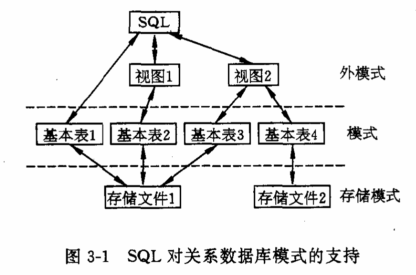

### 3.2 数据定义

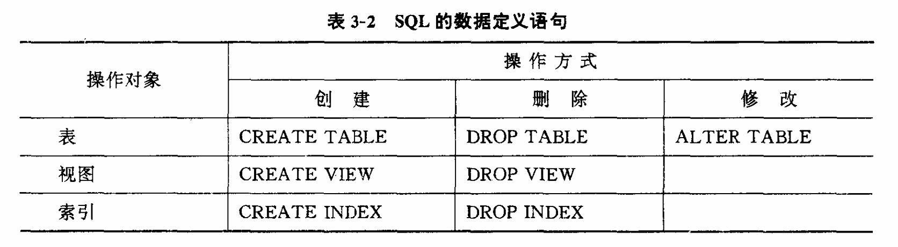

#### 基本表的操作

- **CREATE** TABLE 创建基本表

```SQL
CREATE TABLE<表名>(<列名><数据类型>[列级完整性约束条件]
[,<列名><数据类型>[列级完整性约束条件] ... ]
[,<表级完整性约束条件>]);
```

> 完整性约束涉及多属性列，必须定义在表级上；
> 定义表的各个属性需要指明**数据类型**及**长度**

- **ALTER** TABLE 修改基本表

```SQL
ALTER TABLE <表名>
[ADD<新列名><数据类型>[完整性约束]]
[DROP<完整性约束名>]
[MODIFY<列名><数据类型>];
```

> SQL **没有**提供删除列的语句，只能通过复制保留内容到新表来间接实现

- **DROP** TABLE 删除基本表

```SQL
DROP TABLE <表名>;
```

> 一旦删除，数据和索引都将自动清除；
> 视图虽然保留，但已无法引用

#### 索引的操作

- CREATE INDEX 创建索引

```SQL
CREATE[UNIQUE][CLUSTER]INDEX<索引名>
	ON<表名>(<列名>[<次序>][,<列名>[<次序>]] ... );
```

> ASC/DESC 次序指定索引值排列次序；
> UNIQUE 表示每个索引值只对应唯一的数据记录；
> CLUSTER 表示创建聚簇索引（索引项顺序与表中记录的物理顺序一致）

- DROP INDEX 删除索引

```SQL
DROP INDEX <索引名>;
```

### 3.3 查询 ⭐

#### 单表查询

- 一般格式

```SQL
SELECT [ALL|DISTINCT]<目标列表达式>[,<目标列表达式>] ...
FROM<表名或视图名>[,<表名或视图名>] ...
[WHERE<条件表达式>]
[GROUP BY<列名1>[HAVING<条件表达式>]]
[ORDER BY<列名2>[ASC|DESC]];
```

- 查询全部列

```SQL
SELECT * FROM <表名>;
```

- 查询经过计算的值（算数表达式、字符串常量、函数等）
- 查询满足条件的**元组**


#### 连接查询

- 连接条件：等值/非等值
- 连接方式：卡氏积连接（笛卡尔积）和自然连接（等值去重）
- 表的自身连接
- **外连接**
	- 左外连接：列出左边关系的所有元组
	- 右外连接：列出右边关系的所有元组

#### 嵌套查询

- 带有 IN 谓词的子查询
- 带有比较运算符的子查询（内层查询为单值时可用）
- 带有 **ANY/ALL** 谓词的子查询（必须同时使用比较运算符）
- 带有 **EXIST** 谓词的子查询（只返回 TRUE/FALSE）

> 子查询结果往往是一个集合，所以 IN 往往最常用

#### 集合查询

多个 SELECT 语句的结果合并，用集合操作完成

- **UNION** 并操作
- **INTERSECT** 交操作
- **MINUS** 差操作

> 交操作和差操作在标准 SQL 中没有直接提供，可用其他方法实现

#### 小结（来自教材）

SELECT语句是SQL的核心语句,其语句成份多样,尤其是目标列表达式和条件表达式,可以有多种可选形式,这里总结一下它们的一般格式。

[SELECT 语句的一般格式](database-review-notes.md#单表查询)

目标列表达式有以下可选格式：

```
1. *
2. <表名> .*
3. COUNT([DISTINCT|ALL]* )
4. [<表名>.]<属性列名表达式>[,[<表名>.]<属性列名表达式>] ...
```

其中<属性列名表达式>可以是由属性列、作用于属性列的聚集函数和常量的任意算术运算(+、一、、/)组成的运算公式。

集函数的一般格式为:

```
COUNT|SUM|AVG|MAX|MIN ([DISTINCT|ALL] <列名>)
```

WHERE子句的条件表达式有以下可选格式（见教材P100）

### 3.4 数据更新

#### INSERT 插入数据

两种形式：插入一个元组或者子查询结果（一个或多个元组）

- 插入单个元组

```SQL
INSERT
INTO<表名>[(<属性列1>[,<属性列2>] ... )]
VALUES(<常量1>[,<常量2>] ... )
```

- 插入子查询结果

```SQL
INSERT
INTO <表名>[(<属性列1>[,<属性列2>] ... )]
子查询;
```

#### UPDATE 修改数据

```SQL
UPDATE <表名>
SET <列名>=<表达式>[, <列名>=<表达式>]...
[WHERE <条件>];
```

#### DELETE 删除数据

```SQL
DELETE
FROM <表名>
[WHERE <条件>];
```

> 省略 WHERE 字句，将删除所有元组，但表的定义仍在字典中

### 3.5 视图

#### 定义视图

- CREATE VIEW 创建视图

```SQL
CREATE VIEW <视图名>[(<列名>[,<列名>]...)]
AS <子查询>
[WITH CHECK OPTION]
```

> WITH CHECK OPTION 表示[更新视图](database-review-notes.md#更新视图)时保证操作的行满足视图定义中的谓词条件；
> 视图可以建立在一个或**多个**基本表或**已定义的视图**上

- DROP VIEW 删除视图

> 通常需要显示使用语句删除视图

#### 查询视图

- 视图的消解（view resolution）
	- 把视图的查询和定义中的子查询操作结合起来
	- 转换成对**基本表**的查询

> WHERE 字句不能用集函数作为条件表达式

#### 更新视图

同样要转换为对基本表的更新（不一定都能更新）

## 第 4 章 数据库编程

### 4.1 PL/SQL

PL/SQL 是对 SQL 的扩展，增加了过程化语句功能。

程序的基本结构是块。块可以互相嵌套，每个块完成一个逻辑操作。

#### 变量和常量

- 变量的定义

```
变量名 数据类型 [[NOT NULL]:=初值表达式]
or
变量名 数据类型 [[NOT NULL]初值表达式]
```

- 常量的定义

```
常量名 数据类型 CONSTANT:=常量表达式
```

- 赋值语句

```
变量名:=表达式
```

可能存在隐式类型转换。

#### 游标

一个管理查询结果集的数据缓冲区，可以存放 SQL 语句的执行结果。

游标将一个命名缓冲区和一个查询语句绑定在一起，查询执行后的结果集数据通过游标把面向集合的操作转换成面向元组的操作，用 PL/SQL 语句逐一从游标中获取记录，并赋给主变量，交给过程语言进一步处理每个元组。

[PL/SQL 中的游标是什么？](database-sql-cursor.md)

游标类型：普通游标，REFCURSOR 类型游标，带参数的游标……

游标属性：记录游标当前执行状态的内置标记。

## 第 5 章 数据库保护

### 5.1 安全性

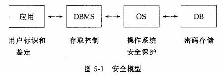

#### 安全概述

数据库安全性：对数据库进行安全控制，保护数据库以防止不合法的使用所造成的数据泄露、更改或破坏。不合法的使用包括对数据库的查询与修改，因此对数据库的任何操作都要进行安全性检查。

数据库的安全性与计算机系统的安全性（计算机硬件、操作系统、网络系统等）紧密联系、相互支持。

**安全标准：**

- **TCSEC**（可信计算机系统评估标准，桔皮书）：1985 年由美国国防部公布，将计算机系统安全划分为 4 组 7 个级别：D（无安全保护）、C1（自主访问控制）、C2（C1 + 审计功能）、B1（C2 + 强制访问控制）、B2（B1 + 解决隐蔽通道）、B3（B2 + 访问监控器）、A（B3 + 较高形式化）
- **TDI**（可信数据库系统解释，紫皮书）：1991 年 NCSC 颁布，将 TCSEC 扩展到 DBMS
- **CC**（通用准则）：1999 年被 ISO 采用为国际标准，目前基本取代了 TCSEC

> 目前国内使用的大多符合 C1 级标准，一部分符合 C2 级标准。

**数据库安全性控制的常用方法**：用户标识和鉴定（身份认证）、存取控制、视图、审计、数据加密。

#### 用户标识和鉴定

系统管理员通过创建用户帐号来管理用户对计算机系统资源的访问。给定每一位用户一个唯一的*标识符*和*口令*，操作系统通过它来判断用户的身份。

上述过程实现了对计算机系统的授权使用，但并不一定授权了对 DBMS 或相关应用程序的访问。授予用户访问 DBMS 的权利还需要经过一个另外的类似过程，这个过程通常是由 DBMS 的 DBA 来完成的，DBA 负责为 DBMS 用户建立用户帐号和口令。 

用户身份鉴别的方法：

- **静态口令鉴别**：口令由用户自己设定，静态不变
- **动态口令鉴别**：每次鉴别使用动态产生的新口令，采用一次一密的方法
- **生物特征鉴别**：通过指纹、虹膜和掌纹等生物特征进行认证
- **智能卡鉴别**：不可复制的硬件，内置集成电路芯片，具有硬件加密功能

用户认证方式：通过操作系统认证、通过数据库认证、通过网络服务认证。

#### 自主存取控制

存取权限的两个组成要素：数据对象和操作类型。

定义存储权限称为**授权**。授权经过编译后存放在数据字典中。

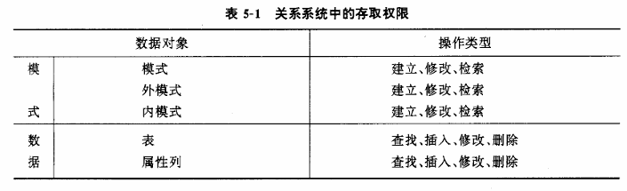

**授权编译程序**和**合法性检查机制**一起组成了安全性子系统。

**授权粒度**：可以定义的数据对象的范围，是衡量授权机制是否灵活的一个重要指标。可以是数据库、表、字段、元组等。


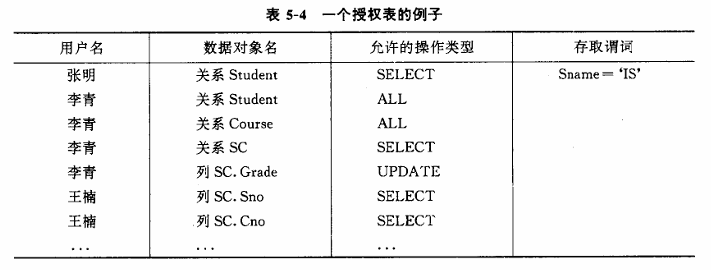

表 5-4 中的授权包含：对整个关系的授权，对属性列授权，与数值有关的授权。

> 与数据值有关的授权的实现难点：难以判断存取谓词之间的语义关系。

例如，张明只能查询信息系（IS）学生的数据。

存取谓词还能引用系统变量，可以限制用户存取数据的时间和终端等。

**最小特权策略**：让用户可以合法地存取或修改数据库的前提下，分配最小的特权，使得这些信息恰好能够完成用户的工作，其余的权利一律不给。

**六种操作权限**：SELECT、INSERT、DELETE、UPDATE、REFERENCE、USAGE。

**自主**存取控制中的”自主”体现在用户可以自由决定将数据的存储权限授予何人。

由此引发的缺陷：数据本身无安全性标记，他人可通过数据备份获得自身权限内副本并进一步传播——强制存取控制需要解决的问题。

#### 强制存取控制

系统强制检查手段，非用户直接感知或进行控制。

全部实体被分为主体和客体两大类。

- 主体：系统中的活动实体，例如数据库用户、代表用户的各进程等。
- 客体：被动实体，受主体操纵，例如文件、基本表、索引、视图等。

**敏感度标记**：绝密 TS，机密 S，可信 C，公开 P，……

通过对比主体和客体的敏感度标记，最终确定主体是否能够存取客体。

- 仅当主体的许可证级别大于或等于客体的密级时，该主体才能读取相应的客体。
- 仅当主体的许可证级别（小于或）等于客体的密级时，该主体才能写相应的客体。

#### 基于角色的存取控制

用户通过角色（role）与权限进行关联：每一种角色对应一组相应的权限，一旦用户被分配了适当的角色后，该用户就拥有此角色的所有操作权限。

优点：简化用户的权限管理，减少系统的开销。

**角色的创建与删除：**

```SQL
CREATE ROLE <角色名>;
DROP ROLE <角色名>;
```

**角色的授权与分配：**

```SQL
-- 给角色授予权限
GRANT <权限>[,<权限>]...
    ON <对象类型><对象名>
    TO <角色>[,<角色>]...;

-- 将角色授予用户或其他角色
GRANT <角色1>[,<角色2>]...
    TO <角色3>[,<用户1>]...
    [WITH ADMIN OPTION];
```

> WITH ADMIN OPTION：获得某种权限的角色或用户还可以把这种权限授予其他角色。

**角色权限的收回：**

```SQL
REVOKE <权限>[,<权限>]...
    ON <对象类型><对象名>
    FROM <角色>[,<角色>]...;
```

**数据库预定义角色**（以 Oracle 为例）：

- **CONNECT**：允许进入数据库
- **RESOURCE**：允许创建数据库对象
- **DBA**：除拥有 CONNECT 和 RESOURCE 权限外，还能对表的数据作操纵，并具有控制与数据库管理权限

#### 视图限制

为不同用户定义不同视图，把要保密的数据对无权存取这些数据的用户隐藏起来。

> 更主要的功能在于提供*数据独立性*，其安全保护功能太不精细。
> 
> 实际应用中，用视图机制先屏蔽掉一部分保密数据，再在视图上进一步定义存储权限。

#### 审计追踪

审计：把用户对数据库的所有操作自动记录下来放入审计日志中，DBA 可以利用审计跟踪的信息，找出非法存取数据的人、时间和内容等。	

> C2 以上安全级别的 DBMS 必须具有审计功能。

**审计的作用：**

- 调查可疑的活动（如确定恶意删除记录的肇事者）
- 监视并收集某类数据库活动的信息（如统计哪些表经常被修改、高峰时刻的并发用户数等）

**审计事件分类：**

- **服务器事件**：审计数据库服务器发生的事件，如服务器启动、停止
- **系统权限**：对系统拥有的结构或模式对象进行操作的审计
- **语句事件**：对 SQL 语句（DDL、DML、DQL、DCL）的审计
- **模式对象事件**：对特定模式对象（表、视图、存储过程等）上进行的 SELECT 或 DML 操作的审计

**审计功能的可选性**：审计很费时间和空间，DBA 可以根据应用对安全性的要求灵活地打开或关闭审计功能。

**审计日志与恢复日志的区别：**

- 记录内容不同：恢复日志只记录更新操作，审计日志记录所有操作
- 组织方式不同：恢复日志严格按操作的时间顺序，审计日志按操作的对象组织

**Oracle 中的审计语句：**

- AUDIT：设置审计功能
- NOAUDIT：取消审计功能

三种审计类型：SQL 语句审计（审计语句本身，不针对操作对象）、系统权限审计（对系统权限使用情况进行审计）、对象权限审计（对某个指定对象的某一类操作进行审计）。

#### SQL 中的安全性控制

**GRANT** 语句向用户授予操作权限。

```SQL
GRANT <权限>[,<权限>]...
	[ON <对象类型><对象名>]
	TO <用户>[,<用户>]...
	[WITH GRANT OPTION];    -- 指定该语句，可以传播权限
```

**REVOKE** 语句收回用户权限。

```SQL
REVOKE [GRANT OPTION FOR] <权限>[,<权限>]...
	[ON <对象类型><对象名>]
	FROM <用户>[,<用户>]...
	[CASCADE | RESTRICT];
```

> 收回权限的操作会**级联**（CASCADE）
> 
> 例如，权限 U1->U2->U3，收回 U1 权限同时 U2、U3 权限也被收回。
> 
> GRANT OPTION FOR：只撤销转授权限，用户仍保留操作权限但不能授予他人。
> 
> CASCADE：删除与当前被撤销权限有依赖关系的视图或 REFERENCES 权限的外键约束；RESTRICT：若有依赖关系则不允许执行 REVOKE。

#### 数据加密

数据加密是防止数据库中数据在存储和传输中失密的有效手段，基本思想是将明文变换为密文。

主要的两种加密方法：

- **替换方法**：将明文中的每一个字符转换为密文中的一个字符
- **置换方法**：将明文的字符按不同的顺序重新排列

#### 统计数据库的安全

统计数据库允许用户查询聚集类型的信息（合计、平均值等），但不允许查询单个记录信息。

安全性问题：可能存在着**隐蔽的信息通道**，使得可以从合法的查询中推导出不合法的信息。

解决办法：

- 规定任何查询至少涉及 N 个以上的记录
- 规定两个查询的相交数据项不能超过 M 个

### 5.2 完整性

数据库的完整性：数据的**正确性**和**相容性**。

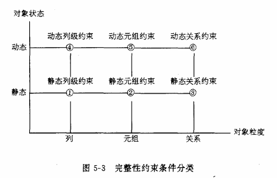

> 数据的完整性与安全性是数据库保护的两个不同的方面。
>
> - 安全性是防止用户非法使用数据库,包括恶意破坏数据和越权存取数据。
> - 完整性则是防止合法用户使用数据库时向数据库中加入不合语义的数据。
>
> 也就是说，安全性措施的防范对象是非法用户和非法操作，完整性措施的防范对象是**不合语义**的数据。

### 5.3 并发控制

#### 概述

DBMS 并发控制以**事务**为单位进行。

并发操作控制不当，导致数据库的**不一致性**。

- 丢失修改

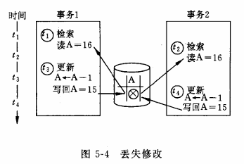

- 不可重复读

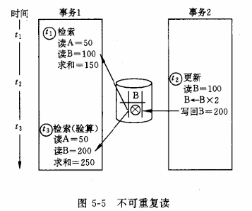

- 读“脏”数据

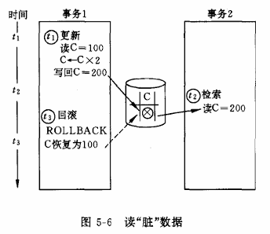

#### 并发操作的调度

**可串行化**的调度：并行调度结果与某一串行序列执行结果相同。

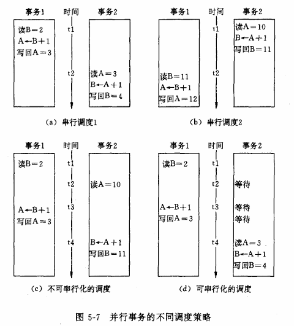

并行事务正确性的唯一准则：**可串行性**。

#### 封锁

两种类型：排他锁（exclusive lock，X 锁）和共享锁（share lock，S 锁）

排他锁又称*写锁*，共享锁又称*读锁*。

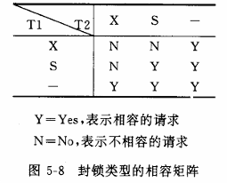

**封锁粒度**：封锁对象的大小。

> 封锁粒度↑ 并发度↓ 系统开销↓，即并发度和系统开销与封锁粒度成负相关

**封锁协议**：申请封锁的特定规则。

参考阅读：[并发控制中的封锁协议](database-lock-protocal.md)

#### 活锁和死锁

> 活锁类比进程的*饥饿*；死锁概念与进程的死锁相同。

### 5.4 恢复

可能发生的故障：事务故障、系统故障和介质故障。

#### 恢复的实现技术

1. 建立冗余数据

	- 数据转储
	- 登录日志文件

> 两种方法通常一起使用。

2. 恢复策略（略）

## 第 6 章 关系数据库设计理论

### 6.1 规范化概述

规范化（Normalization）是关系数据库逻辑设计的一种方法，通过将属性分配给实体以减少数据冗余和更新异常。

规范化过程：将一个低一级范式的关系模式，通过**模式分解**转换为若干个高一级范式的关系模式的集合。范式的转换通过分析和消除属性间的**数据依赖关系**来实现。

属性间的数据依赖包括函数依赖和多值依赖：1NF → 2NF → 3NF → BCNF 考察函数依赖；4NF 考察多值依赖。

属性可分为主属性和非主属性：2NF、3NF 考察**非主属性**和键的关系，BCNF 考察**主属性**和键的关系。

#### 不好的数据库设计中的异常

将过多属性放在同一个关系模式中会导致以下问题：

- **数据冗余** —— 重复存储，浪费大量存储空间
- **修改复杂** —— 更改某个实体的单个属性时需要修改多行记录
- **插入异常** —— 无法插入某个实体实例（因为缺少某些属性的值）
- **删除异常** —— 删除某个实体实例时导致另一个实体实例的信息丢失

> 出现更新异常的根本原因：在单个模式中存在某些不好的数据依赖（函数依赖、多值依赖）。规范化方法就是将一个关系模式分解成多个模式，使得这些依赖不出现在同一个关系模式中。

### 6.2 数据依赖

#### 函数依赖

函数依赖（Functional Dependency）的定义：设 $R(U)$ 是属性集 $U$ 上的关系模式，$X$、$Y$ 是 $U$ 的子集。若对于 $R(U)$ 的任意一个可能的关系 $r$，$r$ 中不可能存在两个元组在 $X$ 上的属性值相等而在 $Y$ 上的属性值不等，则称 $X$ 函数确定 $Y$，或 $Y$ 函数依赖于 $X$，记作 $X \to Y$。

另一种等价定义：若 $R$ 的任意关系满足，对 $X$ 中的每个属性值，在 $Y$ 中都有唯一的值与之对应，则称 $Y$ 函数依赖于 $X$。

**重要性质：**

- 函数依赖是**语义范畴**的概念，只能通过语义确定
- 函数依赖要求对关系模式的**所有**关系都成立

**函数依赖与属性间的联系：**

- 若 $X$、$Y$ 是 1—1 关系，则 $X \to Y$ 且 $Y \to X$
- 若 $X$、$Y$ 是 m—1 关系，则 $X \to Y$ 但 $Y \not\to X$
- 若 $X$、$Y$ 是 m—n 关系，则 $X$、$Y$ 间不存在函数依赖关系

#### 平凡与非平凡函数依赖

- **非平凡函数依赖**：$X \to Y$，但 $Y \not\subseteq X$
- **平凡函数依赖**：$X \to Y$，且 $Y \subseteq X$（一组属性函数决定它的所有子集，对任何关系都成立）

若 $X \to Y$，则 $X$ 叫做**决定因素**。若 $X \to Y$ 且 $Y \to X$，记作 $X \leftrightarrow Y$。若 $Y$ 不函数依赖于 $X$，记作 $X \not\to Y$。

#### 完全函数依赖与部分函数依赖

- **完全函数依赖**：$X \to Y$，且对于 $X$ 的任何真子集 $X'$，都有 $X' \not\to Y$。记作 $X \xrightarrow{f} Y$。
- **部分函数依赖**：$X \to Y$，且存在 $X$ 的真子集 $X'$，使得 $X' \to Y$。记作 $X \xrightarrow{p} Y$。

> 左部为**单属性**的函数依赖一定是完全函数依赖。左部为多属性时，取真子集判断其能否决定右部属性。

#### 传递函数依赖

传递函数依赖：在 $R(U)$ 中，如果 $X \to Y$（$Y \not\subseteq X$），$Y \not\to X$，且 $Y \to Z$，则称 $Z$ 对 $X$ **传递函数依赖**，记作 $X \xrightarrow{t} Z$。

#### 候选键的形式定义

设 $X$ 为 $R\langle U, F \rangle$ 中的属性或属性组，若 $X \xrightarrow{f} U$，则 $X$ 为 $R$ 的**候选键**。其中 $X \to U$ 保证 $X$ 能决定整个元组，$X' \not\to U$ 保证 $X$ 中无多余属性。

相关术语：

- **主键**：选定的候选键（一个关系的主键是唯一的）
- **超键**：若 $X \to U$（不要求无多余属性），则 $X$ 为超键
- **主属性**：包含在**任何一个**候选键中的属性
- **非主属性**：不包含在任何一个候选键中的属性
- **全键**：整个属性组为键

### 6.3 范式

范式（Normal Form）：关系数据库中符合某一级别的关系模式的集合。$R$ 为第几范式可写成 $R \in xNF$。

各范式之间的包含关系：

$$5NF \subset 4NF \subset BCNF \subset 3NF \subset 2NF \subset 1NF$$

> 并不总是需要达到最高范式，还需平衡查询效率和更新代价。

#### 第一范式（1NF）

如果一张表不含有多值属性（重复字段）和内部结构（复合属性），即每个属性都是不可分割的原子值，则称该关系属于 1NF。

> 1NF 是关系模式的最起码要求，但仍可能存在数据冗余和更新异常。

#### 第二范式（2NF）

若 $R \in 1NF$，且每一个**非主属性**完全函数依赖于键，则 $R \in 2NF$。即在 1NF 基础上消除非主属性对主码的**部分函数依赖**。

将 1NF 转化为 2NF 的方法：如果存在部分依赖，将部分依赖的属性从原关系移出，移到一个新关系中，同时将这些属性的决定方也复制到新关系中。

> 2NF 可以消除一些 1NF 中存在的更新异常，但不能彻底消除。

#### 第三范式（3NF）

若 $R \in 2NF$，且每一个**非主属性**不传递函数依赖于键，则 $R \in 3NF$。即在 2NF 基础上消除非主属性对键的**传递函数依赖**。

将 2NF 转化为 3NF 的方法：如果存在传递依赖，将传递依赖的属性从原关系移出，移到一个新关系中，同时将这些属性的决定方也复制到新关系中。

> 3NF 可以消除一些 2NF 中存在的更新异常，但不能彻底消除（存在主属性对键的依赖问题时仍有异常）。

#### BC 范式（BCNF）

Boyce-Codd 范式：$R \in 1NF$，且每一个**决定因素**都包含键，则 $R \in BCNF$。即在 3NF 基础上消除主属性对键的部分函数依赖和传递函数依赖。

重要性质：

- BCNF 是修正了的 3NF，有时也称为"第三范式"
- $R \in BCNF \Rightarrow R \in 3NF$ 必定成立
- $R \in 3NF$，如果 $R$ 只有一个候选码，则 $R \in BCNF$ 必定成立
- **并非所有 3NF 都是 BCNF**（存在多个候选码且主属性之间存在依赖时）

将 1NF 转化为 BCNF 要消除决定因素不为键的函数依赖。任何一个**二目关系**都属于 BCNF。

> BCNF 在函数依赖的范畴内彻底消除了更新异常，但在数据依赖（如多值依赖）的范畴内仍有例外。

#### 多值依赖与第四范式（4NF）

BCNF 在函数依赖范畴内已是最优，但其他数据依赖（如多值依赖）也会产生更新异常。4NF 在 BCNF 基础上进一步消除非平凡的多值依赖。

### 6.4 Armstrong 公理与闭包

#### Armstrong 公理

设 $F$ 是关系模式 $R$ 的函数依赖集，$X$、$Y$ 是 $R$ 的属性子集。如果从 $F$ 的函数依赖中能够推出 $X \to Y$，则称 $F$ **逻辑蕴涵** $X \to Y$。

Armstrong 公理系统（对 $R\langle U, F \rangle$）：

- **A1 自反律**：若 $Y \subseteq X$，则 $X \to Y$（所有平凡函数依赖都成立）
- **A2 增广律**：若 $X \to Y$，则 $XZ \to YZ$（函数依赖两边增加相同属性也成立）
- **A3 传递律**：若 $X \to Y$、$Y \to Z$，则 $X \to Z$（由已知函数依赖可以推导出新依赖）

公理系统的两个特性：

- **正确性**：按阿氏公理推出的依赖都是正确的
- **完备性**：能推出所有的依赖（即所有不能推出的依赖都不成立）

#### 公理的推论

- **合并规则**：若 $X \to Y$、$X \to Z$，则 $X \to YZ$
- **分解规则**：若 $X \to YZ$，则 $X \to Y$、$X \to Z$
- **伪传递规则**：若 $X \to Y$、$WY \to Z$，则 $WX \to Z$
- **复合规则**：若 $X \to Y$、$W \to V$，则 $XW \to YV$

#### 函数依赖集的闭包

函数依赖集 $F$ 的闭包 $F^+$：$F$ 所逻辑蕴含的函数依赖全体。

$$F^+ = \{X \to Y \mid X \to Y \text{ 基于阿氏公理推出}\}$$

$F^+$ 包含三部分：$F$ 中由语义决定的函数依赖、由 $F$ 推出的非平凡函数依赖、由 $F$ 推出的平凡函数依赖。$F^+$ 的计算非常麻烦且可能非常大，实际中很少直接计算。

#### 属性集闭包

属性集 $X$ 关于 $F$ 的闭包 $X_F^+$（简写为 $X^+$）：由 $X$ 从 $F$ 中推出的所有函数依赖右部属性的集合。

$$X_F^+ = \{A \mid X \to A \text{ 能由 } F \text{ 用阿氏公理导出}\}$$

**定理**：$X \to Y$ 能从 $F$ 中用阿氏公理导出的**充要条件**是 $Y \subseteq X_F^+$。

**属性集闭包的计算算法：**

```
设 R<U, F>，求 X 关于 F 的闭包 X+：
(1) X(0) = X
(2) X(i+1) = X(i) ∪ A
    其中 A：对 F 中任一没有使用过的 Yj → Zj，且 Yj ⊆ X(i)；
    所有的这些 Zj 构成 A。求得后对 Yj → Zj 做已使用标记。
    如果找不到这样的 A，则转 (4)
(3) 若 X(i+1) = X(i) 或 X(i+1) = U 则转 (4)，否则转 (2)
(4) 结束，输出 X(i)，即为 X+
```

最多 $|U - X|$ 步。判断结束的四种情况：$X(i+1) = X(i)$、$X(i)$ 包含了所有属性、$F$ 中函数依赖的右边再也找不到 $X(i)$ 中未出现过的属性、$F$ 中未用过的函数依赖的左边已没有 $X(i)$ 的子集。

**属性集闭包的作用：**

- **测试超键**：如果 $X^+$ 包含 $R$ 的所有属性，则 $X$ 是 $R$ 的超键
- **检测函数依赖**：判断 $X \to Y$ 是否成立，只需判断 $Y \subseteq X^+$
- **计算 $F^+$**：计算所有可能的属性子集的闭包，综合得到函数依赖集闭包

#### 函数依赖集的等价

**定义**：如果 $F^+ = G^+$，则称函数依赖集 $F$ 覆盖 $G$，或 $F$ 与 $G$ 等价。

性质：若 $G \subseteq F$，则 $G^+ \subseteq F^+$；$(F^+)^+ = F^+$。

**判断方法（定理）**：$F$ 与 $G$ 等价的充分必要条件是 $F \subseteq G^+$ 且 $G \subseteq F^+$。具体操作：对每个 $X \to Y \in F$，计算 $X_G^+$ 判断 $Y \subseteq X_G^+$；对每个 $X \to Y \in G$，计算 $X_F^+$ 判断 $Y \subseteq X_F^+$。

### 6.5 最小函数依赖集

**定义**：若 $F$ 满足以下三个条件，则称其为最小函数依赖集 $F_m$：

1. $F$ 中每个函数依赖的**右部都是单属性**（右部无多余属性）
2. 对于 $F$ 的任一函数依赖 $X \to A$，$F - \{X \to A\}$ 与 $F$ 都不等价（无多余函数依赖）
3. 对于 $F$ 中的任一函数依赖 $X \to A$ 和 $X$ 的真子集 $X'$，$(F - \{X \to A\}) \cup \{X' \to A\}$ 与 $F$ 都不等价（左部无多余属性）

**定理**：每个 $F$ 都与某个 $F_m$ 等价。最小函数依赖集**不一定唯一**。

**计算算法：**

1. **分解**：使 $F$ 中任一函数依赖的右部仅含单属性
2. **最小化左边的多余属性**：对 $F$ 中任一 $XY \to A$，在 $F$ 中求 $X^+$，若 $A \subseteq X^+$，则 $Y$ 为多余的
3. **删除冗余的函数依赖**：对 $F$ 中任一 $X \to A$，在 $F - \{X \to A\}$ 中求 $X^+$，若 $A \subseteq X^+$，则 $X \to A$ 为多余的

> 注意：第 2、3 步中对**当前** $F$（而非原始 $F$）求闭包。

### 6.6 模式分解

#### 等价模式分解的定义

关系模式的分解是将一个关系模式分解成一组等价的关系子模式的过程。模式分解包括三个方面：属性的分解、关系的分解、函数依赖的分解。

等价模式分解的三个要求：

1. **属性等价**：分解后子模式的属性集之并等于原模式的属性集，即 $A = A_1 \cup A_2 \cup \cdots \cup A_n$
2. **无损连接性**：分解后的关系自然连接等于原关系，即 $R = R_1 \bowtie R_2 \bowtie \cdots \bowtie R_n$
3. **函数依赖保持性**：分解后的函数依赖集之并的闭包等于原函数依赖集的闭包，即 $F^+ = (\bigcup F_i)^+$

> 满足属性等价且有冗余属性（子模式属性有交集）的分解**不一定**具有无损连接性。

#### 无损连接性

**定义**：$R\langle U, F \rangle$ 的分解 $\rho = \{R_1, R_2, \ldots, R_k\}$，对 $R$ 中任何一个关系 $r$，有 $r = \Pi_{R_1}(r) \bowtie \Pi_{R_2}(r) \bowtie \cdots \bowtie \Pi_{R_k}(r)$，则称分解 $\rho$ 具有无损连接性。

**无损连接性检验算法（chase 算法）：**

1. 构造 $k$ 行 $n$ 列的表：第 $i$ 行对应 $R_i$，第 $j$ 列对应 $A_j$。若 $A_j \in R_i$，放 $a_j$；否则放 $b_{ij}$
2. 重复考察 $F$ 中每个函数依赖 $X \to Y$：在 $X$ 的分量中寻找相同的行，然后将这些行中 $Y$ 的分量改为相同符号。若其中有 $a_j$，则将 $b_{ij}$ 改为 $a_j$；若其中无 $a_j$，则全部改为 $b_{ij}$（$i$ 为这些行的最小行号）
3. 若某一行变成 $a_1, a_2, \ldots, a_n$，则具有无损连接性；若所有函数依赖都不能再修改表且无这样的行，则不具有无损连接性

**特殊情况（分解为两个子模式）：**

$\rho = \{R_1, R_2\}$ 具有无损连接性的充要条件：

$$R_1 \cap R_2 \to (R_1 - R_2) \in F^+ \quad \text{或} \quad R_1 \cap R_2 \to (R_2 - R_1) \in F^+$$

> 不必求 $F^+$，利用属性闭包判断即可。此定理仅适用于分解为 2 个子模式的情况。

#### 函数依赖保持性

$F$ 在属性集 $Z$ 上的投影：$\Pi_Z(F) = \{X \to Y \mid X \to Y \in F^+ \text{ 且 } XY \subseteq Z\}$

分解 $\rho = \{R_1, R_2, \ldots, R_k\}$ 具有函数依赖保持性，当且仅当 $F$ 等价于 $\Pi_{R_1}(F) \cup \Pi_{R_2}(F) \cup \cdots \cup \Pi_{R_k}(F)$。

保持函数依赖的分解意味着原来的函数依赖关系都分散在分解后的子模式中，无语义丢失。

#### 模式分解算法

对关系模式进行分解使其达到 3NF 或 BCNF，但不一定都能同时保证无损连接性和函数依赖保持性：

- 3NF 分解可以同时保证无损连接性和函数依赖保持性
- BCNF 分解可以保证无损连接性，但**不一定**能保证函数依赖保持性

**算法 4.4：转换为 3NF 的保持无损连接及函数依赖的分解**

```
设 R<U, F>：
① 最小化：求 F 的最小函数依赖集 Fm
② 排除：对 Fm 中任一 X → A，若 XA = U 则不分解（R 已为 3NF），结束
③ 独立：若 R 中 Z 属性在 Fm 中未出现，则所有 Z 为一个子模式，令 U = U - Z
④ 分组：对 Fm 中 X → A1, ..., X → An，用合并规则合成一个；
   再对 Fm 中每个 X → A，令 Ri = XA。R 的分解为 {R1, R2, ..., Rk}
⑤ 添键：如果分解中没有一个子模式含 R 的候选键 X，
   则将分解变成 {R1, R2, ..., Rk, X}；如果存在 Ri ⊆ Rj，则删去 Ri
```

> 步骤 ①~④ 保证函数依赖保持性，加上步骤 ⑤ 保证无损连接性。

**算法 4.5：转换为 BCNF 的保持无损连接的分解**

```
设 R<U, F>：
① 令 ρ = {R}
② 如果 ρ 中的所有关系模式都是 BCNF，结束
③ Ri<Ui, Fi> 为 ρ 中不是 BCNF 的一个关系模式，
   则 Ri 中必有 X → A（A ∉ X）且 X 不是 Ri 的键。
   将 Ri 分解为 S1 = XA，S2 = Ui - A，更新 ρ，转 ②
```

### 6.7 反规范化设计

使用规范化方法设计数据库的逻辑结构时，并不是要使所有模式都达到最高范式，还需要平衡查询效率和更新代价。

反规范化设计：对某些特定应用不进行规范化，而是通过使用冗余来改进性能（提高查询效率）。进行反规范化设计后，需要采取措施处理可能出现的更新异常。

> 规范化会降低查询效率（关系模式的分解导致查询时需要连接操作），而反规范化正是为了在某些场景下以更新代价换取查询效率。

## 第 7 章 数据库设计

### 7.1 数据库系统设计概述

数据库系统设计：对于一个给定的应用环境，构造最优的数据库模式，建立数据库及其应用系统，使之能够有效地存储数据，满足各种用户的应用需求（信息要求、处理要求、安全性需求、完整性需求和性能需求）。

**数据库系统设计的特点**：数据库设计应该和应用系统设计相结合 —— **结构（数据）设计**和**行为（处理）设计**密切结合起来。

#### 易混淆的术语

- **数据库设计**：利用开发环境表达用户要求、设计构造最优的数据模型，然后据此建立数据库及其应用系统
- **数据库管理系统（DBMS）设计**：设计位于用户和操作系统之间的数据管理软件
- **数据库系统设计**：涵盖数据库及其应用系统的整体设计
- **数据库应用系统（DBAS）设计**：在 DBMS 支持下建立的计算机应用系统的设计
- **管理信息系统设计**：为系统实现制定蓝图，解决"怎么做"的问题

#### 数据库系统的人员组成

- **数据库管理员（DBA）**：进行数据库的规划、设计、协调、维护和管理
- **系统分析员**：负责应用系统的需求分析和规范说明，与 DBA 和用户一起确定硬件平台和软件设置，参与 DBS 设计
- **程序设计员**：负责设计和编制应用系统程序模块，并进行调试和安装
- **用户**：参与可行性研究与需求分析

### 7.2 数据库的生命周期

数据库的生命周期同时也是数据库应用系统的生命周期，包括以下阶段：

1. **需求分析** —— 准确了解应用（数据与处理）需求
2. **概念结构设计** —— 形成独立于 DBMS 的概念模型
3. **逻辑结构设计** —— 转换为某 DBMS 支持的数据模型
4. **物理结构设计** —— 选取最适合应用环境的物理结构
5. **数据库实施** —— 编调程序，组织数据入库，试运行
6. **数据库运行与维护** —— 运行时评价、调整与修改

> 数据库设计的基本思想：**过程迭代和逐步求精**。设计方法包括手工试凑法和规范设计法。

### 7.3 需求分析

#### 需求分析的任务

通过详细调查现实世界要处理的对象（组织、部门、企业等），充分了解原系统（手工系统或计算机系统）工作概况，明确系统的各种需求，然后在此基础上确定新系统的功能。

需求分析需要明确的需求包括：**信息需求**、**处理需求**、**安全性与完整性要求**、**性能需求**。

#### 需求分析的方法

- 分析和表达用户需求的方法：**自顶向下**（TOP-DOWN）和**自底向上**两种
- 具体调查方法：跟班作业、开调查会、请专人介绍、询问、设计调查表请用户填写、查阅记录

#### 需求分析的步骤

1. 调查组织机构
2. 调查各部门的业务活动情况
3. 明确用户需求（信息要求、处理要求、安全性与完整性要求、特殊的性能要求）
4. 计算机应用现状
5. 确定新系统的边界

> 需求分析阶段强调**前瞻性**和**用户参与**。

#### 需求分析的成果

- **数据流图（DFD）**：表达数据和处理过程的关系
- **数据字典（DD）**：描述系统中的数据（对数据的数据项、数据结构、数据流、数据存储、处理逻辑等进行定义和描述）

### 7.4 概念结构设计

#### 概念结构设计的任务

将需求分析得到的用户需求抽象为信息结构即**概念模型**的过程。概念结构设计是**整个数据库设计的关键**。

#### 概念模型的特点

- 能真实、充分地反映现实世界，能满足用户对数据的处理要求
- 易于理解
- 易于更改
- 易于转换（向与计算机相关的数据模型）

#### 概念结构设计的方法

- **自顶向下**：首先定义全局概念的框架，然后逐步细化
- **自底向上**：首先定义各局部应用的概念结构，然后集成
- **逐步扩张**：首先定义最重要的核心概念结构，然后向外扩充
- **混合策略**：用自顶向下策略设计全局概念结构框架，以它为骨架集成由自底向上策略设计的各局部概念结构

> 无论采用哪种方法，一般都以 **E-R 模型**为工具来描述概念结构。

#### 自底向上设计方法

**局部视图设计：**

1. 选择局部应用 —— 在多层数据流图中选择一个适当层次的数据流图作为设计分 E-R 图的出发点
2. 逐一设计分 E-R 图（以数据字典为出发点定义分 E-R 图，再做适当调整）

**视图集成：**

- 集成方式：一次集成 或 两两逐步集成
- 集成步骤：
	- **合并**：解决各分 E-R 图之间的冲突（**属性冲突**、**命名冲突**、**结构冲突**）
	- **修改和重构**：消除不必要的冗余，形成初步 E-R 图

> 消除冗余有两种方法：**分析方法**（以 DD 和 DFD 为依据，根据数据项之间的逻辑关系消除冗余）和**规范化理论**。

#### 概念结构设计的文档

- 概念模型（E-R 图）
- 数据字典

### 7.5 逻辑结构设计

#### 逻辑结构设计的任务

把概念结构阶段设计好的基本 E-R 图转换为与选用 DBMS 产品所支持的数据模型相符合的逻辑结构，包括数据库模式和子模式。

#### 逻辑结构设计的步骤

1. E-R 图向数据模型转换（详见 UNIT 12、UNIT 13）
2. 数据模型的优化（通常以**规范化理论**为指导，详见 UNIT 14、UNIT 15）
3. 子模式（外模式）设计
4. 应用程序设计（初步）

> 逻辑设计阶段的主要目标是把概念模型转换为具体计算机上 DBMS 所支持的结构数据模型。

### 7.6 物理结构设计

#### 物理设计的任务

为一个给定的逻辑数据模型选取一个最适合应用要求的物理结构的过程。

数据库的物理结构：数据库在物理设备上的**存储结构**与**存取方法**。

#### 物理设计的步骤

1. **确定数据库的物理结构** —— 主要指存取方法和存储结构
2. **对物理结构进行评价** —— 评价的重点是**时间和空间效率**

> 物理设计过程中需要对时间效率、空间效率、维护代价和各种用户要求进行权衡，从多种方案中选出最优方案。

#### 物理设计的内容

- **优化目标**：使 DB 上运行的各种事务响应时间小、存储空间利用率高、事务吞吐率大
- **设计方法**：
	- 了解每个事务在各关系上运行的频率和性能要求
	- 充分了解所用 RDBMS 的存取方法和存储结构
	- 对要运行的事务详细分析，获得相关参数
- **设计内容**：
	- 为关系模式选取存取方法
	- 设计关系、索引等数据库文件的物理存储结构

### 7.7 数据库实施

数据库实施阶段的主要工作：

1. 定义数据库结构
2. 数据装载
3. 编制与调试应用程序
4. 数据库试运行

### 7.8 数据库运行与维护

数据库投入运行标志着开发任务的基本完成和维护工作的开始。对数据库的日常维护工作主要由 DBA 完成，内容包括：

1. 数据库的转储和恢复
2. 数据库的安全性和完整性控制
3. 数据库性能的监督、分析和改进
4. 数据库的重组织和重构造
