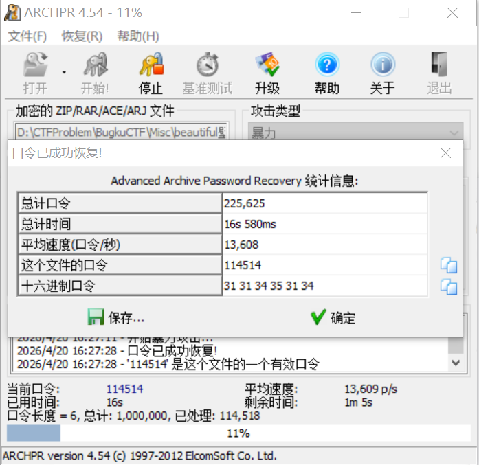
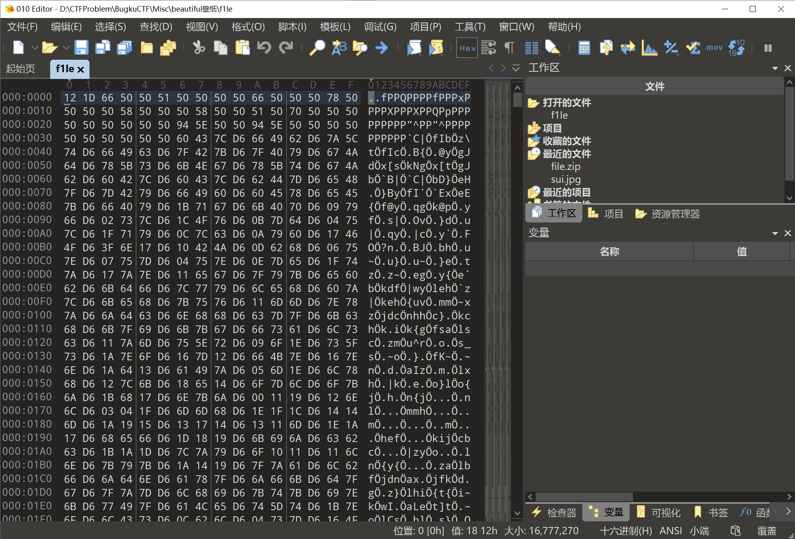
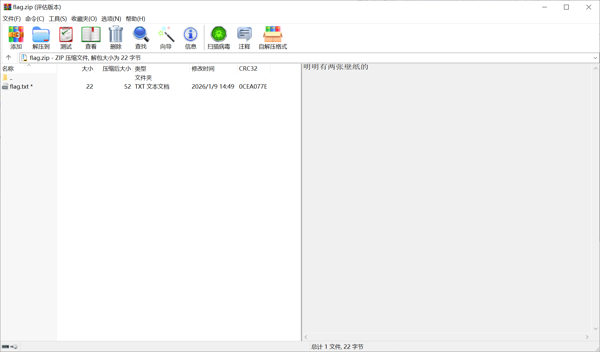
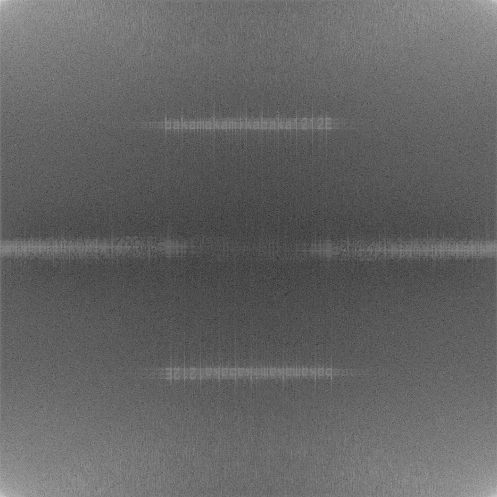

# [Misc]beautiful壁纸

下载的压缩包有解密，无伪解密，无提示信息，直接暴力破解。



解压得到文件：

- f1le
- flag.zip
- sui.jpg

先看下 sui.jpg，在文件末端有一段信息：`++++++++++++++++++++++++++++++++++++++++++++++++++++++++++++++++++++++++++++++++++++++++++++++.-----------------------------------------.-----.`

有经验的师傅一眼丁真，鉴定为（反人类的）Brainfuck（没经验的看这里，或者自己问 LLM）

在线网站解密：<https://www.splitbrain.org/services/ook>，得到信息：`^50`

这个 ^ 一般表示**异或**运算

再看下 f1le 这个文件，能观察到有规律出现的字符，结合刚才的提示猜测是 **BMP** 文件被异或加密了，于是写个解密脚本：



```python
with open("f1le", "rb") as f:
    raw_data = f.read()

decrypted_data = bytes([b ^ 0x50 for b in raw_data])

with open("f1le.bmp", "wb") as f:
    f.write(decrypted_data)
```

成功复原图片！

flag.zip 有一个备注：“明明有两张壁纸的”，但是现在只有一个文件，也就是从当前文件提取出图片——暗示盲水印



这里由于没有原图，用不了 python 版本的工具，改用这个 java 版本的：<https://github.com/ww23/BlindWatermark/>，输入命令：

```bash
java -jar BlindWatermark-v0.0.3.jar decode -f f1le.bmp output.png
```

分离出盲水印，得到字符串即 flag.zip 压缩包密码：`bakamakamikabaka1212E`



解压缩文件即可获得 flag：`bugku{so_e@sy_y3s_???}`
