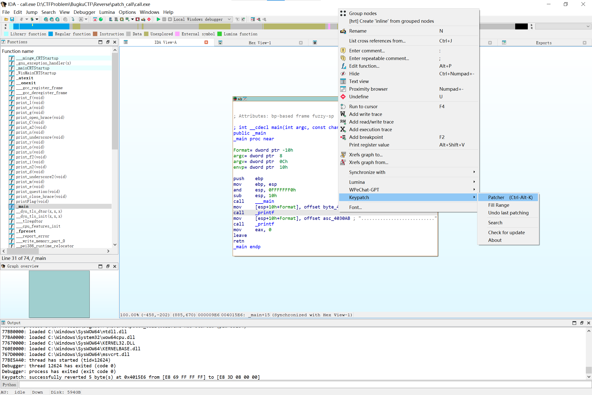
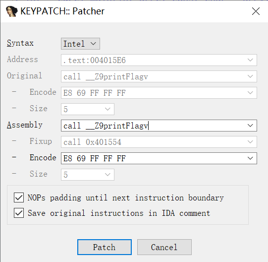
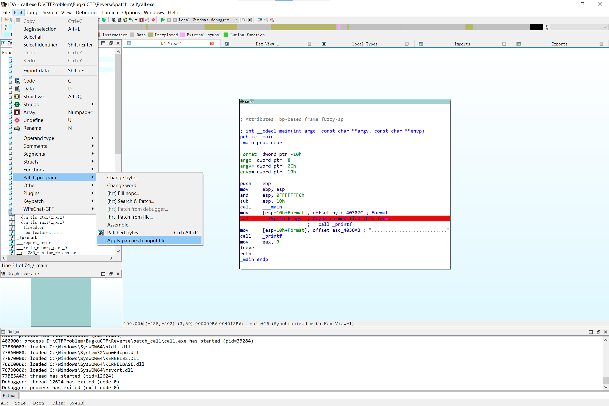
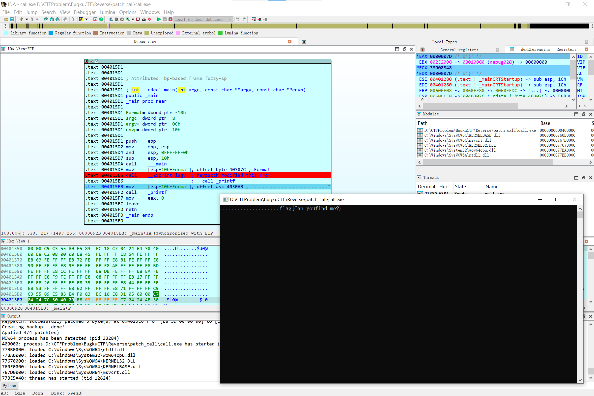

# [Reverse]patch_call

IDA 打开 exe 文件，查看汇编和反编译代码：

```c
int __cdecl main(int argc, const char **argv, const char **envp)
{
  __main();
  printf(&Format_);
  printf("...........................");
  return 0;
}
```

主程序有三个函数调用，依次断点调试，在第三个断点处程序出现输出：


查看 IDA 反编译的所有函数，发现一个 `printFlag` 函数：

```c
int printFlag(void)
{
  printf("....................");
  print_f();
  print_l();
  print_a();
  print_g();
  print_open_brace();
  print_C();
  print_a2();
  print_n();
  print_underscore();
  print_y();
  print_o();
  print_u();
  print_f2();
  print_i();
  print_n2();
  print_d();
  print_underscore2();
  print_m();
  print_e();
  print_question();
  return print_close_brace();
}
```

直接得出 flag：`flag{Can_youfind_me?}`

另解：找到 `printFlag` 函数的地址，在主程序任一 call 代码使用 Keypatch 插件修改调用







保存修改后断点单步执行看到调用函数结果：


